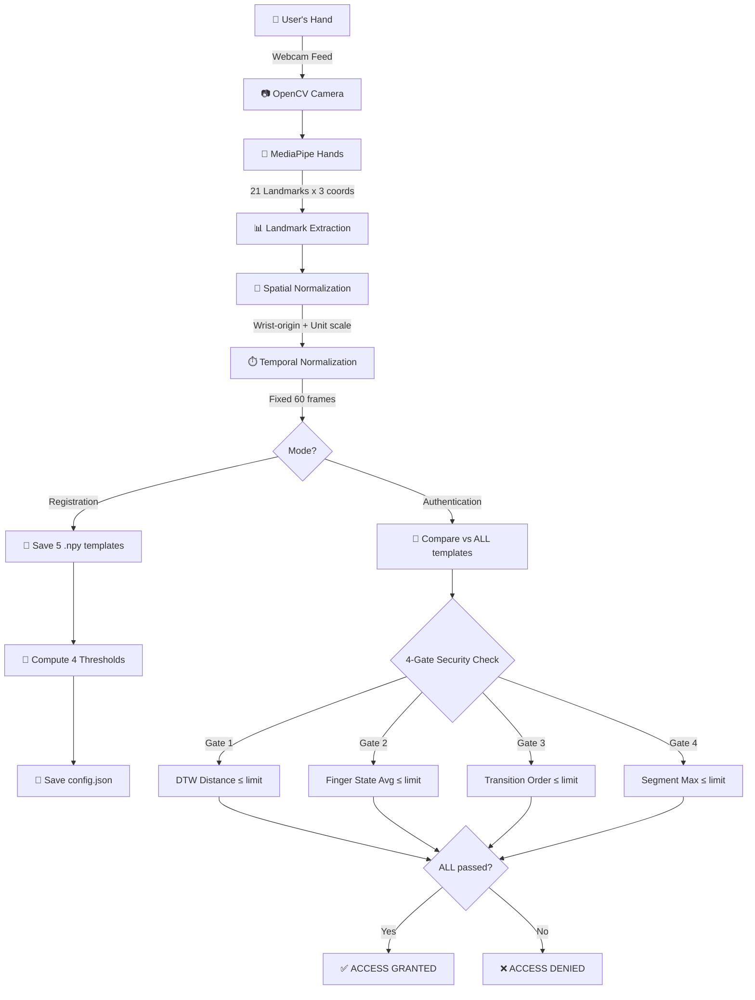

# 🔐 WaveLock — Gesture-Based Biometric Authentication System

> **Complete Project Guide & Documentation**

## 1. Project Overview

**WaveLock** is a real-time, webcam-based biometric authentication system that uses **hand gesture recognition** as a password. Instead of typing a password, users register a unique hand gesture (e.g., a wave, a sequential finger pattern like "1-2-4-3", a custom movement) and authenticate by performing that same gesture live on camera.

The system uses **MediaPipe** for real-time hand tracking, extracts **21 hand landmarks** per frame, applies strict spatial and temporal normalization, and evaluates gestures using a **4-Gate Security Architecture**. This multi-layered approach ensures precise authentication while strictly rejecting spoofing attempts or malformed gestures.

### Key Features

| Feature | Description |
|---------|-------------|
| 🖐️ **Real-time hand tracking** | MediaPipe detects 21 3D landmarks per hand at webcam speed (~30 FPS). |
| 📝 **Multi-sample registration** | Records **5 gesture samples** to capture natural human variation and calculate personalized thresholds. |
| 🔢 **Auto-calibrated thresholds** | Computes per-user authentication limits dynamically from registration data using statistical models. |
| 📐 **Dual normalization** | **Spatial** (position/scale invariant) + **Temporal** (speed/duration invariant via interpolation to exactly 60 frames). |
| 🔒 **4-Gate Security System** | Combines DTW Distance, Finger State Average, Finger Transition Order, and Segment Max Mismatch. |
| 🎯 **Best-match authentication** | Compares live input against ALL stored samples, strictly requiring passing all 4 gates. |
| 🖥️ **Live OpenCV UI** | Visual feedback with progress bars, status banners, and detailed on-screen result overlays. |

---

## 2. Architecture



### Data Flow Pipeline

```
Raw webcam frame
    │
    ▼
MediaPipe hand detection
    │
    ▼
Raw Landmarks: Shape (N, 21, 3) 
    │  [N varies based on gesture duration, e.g., 75 frames]
    ▼
Spatial Normalization: Center on wrist, scale to unit sphere
    │
    ▼
Temporal Normalization: Linear interpolation along time axis
    │
    ▼
Normalized Gesture: Shape (60, 21, 3)
    │  [Exactly 60 frames, ready for 1:1 comparison]
    ▼
Authentication Engine / Security Gates
```

---

## 3. The 4-Gate Security Architecture

To prevent false acceptances (e.g., performing a similar but incorrect gesture like "1-2-3" instead of "1-2-4-3"), WaveLock evaluates every gesture across 4 dimensions. A single failure in *any* gate results in access denial.

1. **Gate 1: DTW Distance** (Dynamic Time Warping)
   - Evaluates the overall 3D trajectory and motion path of the gesture.
   - Prevents completely different physical movements from passing.
2. **Gate 2: Finger State Average Mismatch**
   - Evaluates whether the correct fingers are extended across the entirety of the 60 frames.
   - Prevents gestures that use the wrong fingers overall.
3. **Gate 3: Finger Transition Order** *(New)*
   - Extracts the exact sequential order of finger movements (e.g., `Index Up` → `Middle Up` → `Ring Up`).
   - Uses Levenshtein edit distance to strictly verify sequential passwords.
   - Catches incorrect ordering (e.g., "1-3-2-4") or missing steps.
4. **Gate 4: Segment Max Mismatch** *(New)*
   - Divides the 60 frames into 6 discrete 10-frame segments and evaluates the *worst* segment.
   - Catches localized spoofing attacks where a gesture is 90% correct but uses the wrong fingers during a critical 10% window.

---

## 4. Directory Structure

```text
gesture_auth_project/
├── gesture_auth.py       # MAIN: Run this to authenticate
├── gesture_capture.py    # MAIN: Run this to register a new user
├── gesture_compare.py    # CORE: Security gates, DTW, thresholds
├── utils/
│   ├── landmarks.py      # Helpers for MediaPipe → NumPy
│   └── normalize.py      # Spatial & temporal math
├── templates/            # Auto-generated
│   └── <username>/
│       ├── config.json   # Auto-calibrated thresholds
│       ├── gesture_1.npy # Stored sample (60, 21, 3)
│       └── ...
└── PROJECT_GUIDE.html    # Standalone HTML documentation
```

---

## 5. Core Modules

### `gesture_auth.py`
The entry point for logging in.
- Lists registered users and prompts for a username.
- Loads the user's `config.json` thresholds and `.npy` templates.
- Runs the 3-second recording loop and visualizes real-time progress.
- Calls the comparison engine and overlays the detailed results (pass/fail per gate) on the webcam feed.

### `gesture_capture.py`
The entry point for registering new users.
- Guides the user through performing their gesture **5 separate times**.
- Validates the captures (rejecting attempts with too few frames).
- Calls the threshold calibration engine and saves the resulting templates and `config.json`.

### `gesture_compare.py`
The mathematical and security core of the system.
- **Distance calculation:** `compute_dtw_distance()`
- **Finger state logic:** `compute_finger_state_mismatch()`, `_joint_angle_degrees()`
- **Sequence verification:** `extract_finger_transitions()`, `_levenshtein_distance()`, `compute_transition_dissimilarity()`
- **Segment verification:** `compute_segment_max_mismatch()`
- **Threshold calibration:** `compute_threshold_details()` (calibrates all 4 limits dynamically)
- **Decision Engine:** `authenticate_with_details()` (processes the 4-gate logic)

### `utils/normalize.py`
- `normalize_spatial()`: Subtracts wrist coordinates and divides by maximum Euclidean distance to bound the hand in a unit sphere.
- `normalize_temporal()`: Uses `scipy.interpolate.interp1d` to resample `N` frames to exactly 60 frames.

---

## 6. Configuration Format (`config.json`)

Stored in `templates/<username>/config.json`. Defines the security limits for the specific user.

```json
{
  "threshold": 2.3094,               // Limit for Gate 1 (DTW)
  "finger_state_threshold": 0.2233,  // Limit for Gate 2 (Avg Mismatch)
  "transition_threshold": 0.3657,    // Limit for Gate 3 (Order)
  "segment_threshold": 0.3800,       // Limit for Gate 4 (Segment Max)
  "num_samples": 5,                  // Number of templates stored
  "threshold_method": "statistical_v2", 
  "pairwise_distances": [...],       // Debug data from calibration
  "consistency_score": 74.83         // Score out of 100 based on variance
}
```

---

## 7. Setup and Usage

### Requirements
- Python 3.8+
- OpenCV (`cv2`)
- MediaPipe (`mediapipe`)
- NumPy (`numpy`)
- SciPy (`scipy`)
- DTAIDistance (`dtaidistance`)

### Step 1: Register
```bash
python gesture_capture.py
```
*Enter a username and follow the on-screen prompts to perform your gesture 5 times.*

### Step 2: Authenticate
```bash
python gesture_auth.py
```
*Enter your username, press `[R]` to record, and perform your gesture. The system will display granular pass/fail metrics for all 4 security gates.*
