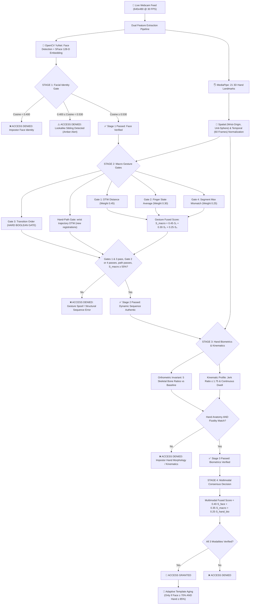

# 🔐 WaveLock — Multimodal Biometric Authentication System

> **Complete Project Guide & Architectural Overview**

---

## 1. Project Overview: Gunshot Summary

**WaveLock** is a real-time, zero-trust **Multimodal Biometric Authentication System** that transforms natural human motion and physiological identity into a high-security digital credential. 

Traditional authentication systems present severe security trade-offs:
- **Alphanumeric passwords & PINs**: Subject to keystroke logging, brute-forcing, and shoulder-surfing.
- **Standalone 2D Face Recognition**: Highly vulnerable to 2D printed photo attacks, digital replay spoofing, and family lookalikes/twins.
- **Standalone Gesture Systems**: Vulnerable to observation-replay attacks if an attacker observes the gesture pass-sequence and imitates it.

WaveLock solves all three vulnerabilities by binding **who you are** (Facial Identity & Hand Bone Morphology) with **what you know** (Secret Dynamic Gesture Sequence) and **how you move** (Neuromotor Kinematic Jerk and Fluidity) into a **4-Stage Sequential & Conjunctive Cascade**.

```
              ┌──────────────────────────────────────────────────────────┐
              │           WAVELOCK MULTIMODAL CASCADED DEFENSE           │
              └─────────────────────────────┬────────────────────────────┘
                                            │
   ┌────────────────────────────────────────┼────────────────────────────────────────┐
   ▼                                        ▼                                        ▼
[WHO YOU ARE]                             [WHAT YOU KNOW]                          [HOW YOU MOVE]
• SFace 128-D Deep Facial Embeddings      • Secret Finger Sequence (e.g. 1-2-4-3)  • Dimensionless Jerk Ratio (≤ 1.75)
• Anti-Sibling Strict Gate (θ = 0.530)    • 3D DTW Spatial Trajectory Match        • Subconscious Velocity Envelopes
• 5 Scale-Invariant Hand Bone Ratios      • Segment-Wise Local Motion Invariance   • Dwell / Pause Acceleration Curvature
```

---

### Key Architectural Pillars

| Component | Technology | Primary Security Function |
| :--- | :--- | :--- |
| 👤 **Stage 1: Facial Identity Anchor** | OpenCV YuNet + SFace (128-D) | Verifies the subject's physical identity; blocks unauthorized individuals instantly. |
| 🛡️ **Anti-Sibling / Lookalike Defense** | Elevated Threshold ($\theta = 0.530$) + Floor ($0.400$) | Blocks lookalike siblings and family members wearing spectacles or pulling hair back. |
| 🖐️ **Stage 2: Dynamic Gesture Password** | MediaPipe (21 3D landmarks, 60 frames) | Verifies knowledge of the secret multi-segment trajectory and finger transitions. |
| 🦴 **Stage 3: Hand Orthometrics** | 5 Scale-Invariant Bone Length Ratios | Distinguishes the genuine user's hand skeleton from an impostor who observed the gesture. |
| ⚡ **Stage 3: Neuromotor Kinematics** | Dimensionless Jerk ($J_{\text{dim}}$) & Fluidity | Distinguishes fluent subconscious muscle memory from hesitant, conscious imitation. |
| 🔒 **Stage 4: Multimodal Score Fusion** | Conjunctive Decision Consensus | Fuses Face ($40\%$), Gesture ($35\%$), and Hand Biometrics ($25\%$) into a unified grant decision. |
| 🔄 **Anti-Poisoning Adaptive Aging** | Dual Biometric Gate Lock | Auto-updates templates on natural drift only if face $\ge 70\%$ and hand $\ge 85\%$ match. |

---

## 2. Complete System Architecture


```mermaid
graph TD
    A["🎥 Live Webcam Feed (640x480 @ 30 FPS)"] --> B["Dual Feature Extraction Pipeline"]
    
    %% Feature Extraction
    B --> C["👤 OpenCV YuNet: Face Detection + SFace 128-D Embedding"]
    B --> D["🖐️ MediaPipe: 21 3D Hand Landmarks"]
    
    %% Stage 1: Face Verification
    C --> E{"STAGE 1: Facial Identity Gate"}
    E -->|Cosine < 0.400| F1["❌ ACCESS DENIED: Impostor Face Identity"]
    E -->|0.400 ≤ Cosine < 0.530| F2["⚠️ ACCESS DENIED: Lookalike Sibling Detected (Amber Alert)"]
    E -->|Cosine ≥ 0.530| G["✅ Stage 1 Passed: Face Verified"]
    
    %% Stage 2: Dynamic Gesture
    D --> H["📐 Spatial (Wrist-Origin, Unit-Sphere) & Temporal (60 Frames) Normalization"]
    G --> I{"STAGE 2: Macro Gesture Gates"}
    H --> I
    I --> I1["Gate 1: DTW Distance (Weight 0.45)"]
    I --> I2["Gate 2: Finger State Average (Weight 0.30)"]
    I --> I3["Gate 3: Transition Order (HARD BOOLEAN GATE)"]
    I --> I4["Gate 4: Segment Max Mismatch (Weight 0.25)"]
    I --> I5["Hand-Path Gate: wrist trajectory DTW (new registrations)"]
    I1 & I2 & I4 --> J1["Gesture Fused Score: S_macro = 0.45·S₁ + 0.30·S₂ + 0.25·S₄"]
    I3 & I5 & J1 --> K{"Gates 1 & 3 pass, Gate 2 or 4 passes, path passes, S_macro ≥ 55%?"}
    K -->|No| L["❌ ACCESS DENIED: Gesture Spoof / Structural Sequence Error"]
    K -->|Yes| M["✅ Stage 2 Passed: Dynamic Sequence Authentic"]
    
    %% Stage 3: Hand Biometrics
    M --> N{"STAGE 3: Hand Biometrics & Kinematics"}
    H --> N
    N --> N1["Orthometric Invariant: 5 Skeletal Bone Ratios vs Baseline"]
    N --> N2["Kinematic Profile: Jerk Ratio ≤ 1.75 & Continuous Dwell"]
    N1 & N2 --> O{"Hand Anatomy AND Fluidity Match?"}
    O -->|No| P["❌ ACCESS DENIED: Impostor Hand Morphology / Kinematics"]
    O -->|Yes| Q["✅ Stage 3 Passed: Biometrics Verified"]
    
    %% Stage 4: Multimodal Consensus
    Q --> R["STAGE 4: Multimodal Consensus Decision"]
    R --> S["Multimodal Fused Score = 0.40·S_face + 0.35·S_macro + 0.25·S_hand_bio"]
    S --> T{"All 3 Modalities Verified?"}
    T -->|Yes| U["🎉 ACCESS GRANTED"]
    T -->|No| V["❌ ACCESS DENIED"]
    U --> W["🔄 Adaptive Template Aging (Only if Face ≥ 70% AND Hand ≥ 85%)"]
```

---

## 3. The Multi-Layered Security Engine

### Stage 1: Facial Identity Anchor & Anti-Sibling Defense
- **Model**: OpenCV YuNet (Detector, 232 KB) + SFace (128-D Recognizer, 38.7 MB ONNX).
- **Metric**: Cosine Similarity $S_{\text{cos}} = \frac{\mathbf{u} \cdot \mathbf{v}}{\|\mathbf{u}\|_2 \|\mathbf{v}\|_2} \in [-1.0, 1.0]$.
- **The Sibling Confounder Solved**:
  - The standard OpenCV threshold ($\theta = 0.363$) was calibrated for unrelated strangers. Real-world testing revealed that a sibling with hair pulled back and wearing the user's spectacles achieved a **75% confidence match ($0.53$ cosine similarity)** due to shared craniofacial bone structure and periocular frame occlusion.
  - WaveLock elevates the operational threshold to **$\theta_{\text{face}} = 0.530$** with a lookalike detection floor at **$0.400$**:
    - **$\ge 0.530$ (Genuine Match)**: Green HUD tracking box (`[MATCH] <user> (92%)`).
    - **$0.400 - 0.529$ (Sibling / Lookalike Zone)**: Amber HUD tracking box (`[ALERT] Sibling / Lookalike (0.51)`), strictly denying access with `lookalike_sibling_detected`.
    - **$< 0.400$ (Stranger Zone)**: Red HUD tracking box (`[ALERT] Impostor Face`), denied with `impostor_face_identity`.

---

### Stage 2: Macro-Gesture Security Gates
1. **Gate 1: Dynamic Time Warping (DTW) Distance (Weight: $0.45$)**:
   - Evaluates the global 3D trajectory across all 21 landmarks over 60 normalized frames.
   - C-optimized via `dtaidistance`. Immune to speed variations while catching trajectory deviations.
2. **Gate 2: Finger State Average Mismatch (Weight: $0.30$)**:
   - Computes 3D inter-phalangeal joint angles per frame to determine whether each finger is extended ($\ge 150^\circ$) or folded.
   - Catches gestures using incorrect finger combinations.
3. **Gate 3: Finger Transition Order (HARD GATE)**:
   - Extracts the sequential transitions of finger extension (e.g., Index Up $\rightarrow$ Pinky Up $\rightarrow$ Thumb Up).
   - Evaluates Levenshtein edit distance against stored patterns. **If the sequential order is wrong, access is immediately denied regardless of confidence scores.**
4. **Gate 4: Segment Max Mismatch (Weight: $0.25$)**:
   - Divides 60 frames into 6 discrete temporal segments (10 frames each) and evaluates the worst-performing segment.
   - Catches localized spoofing attacks where an attacker gets only part of the gesture correct.
5. **Hand-Path Gate (users registered with raw recordings)**:
   - Pose normalization centres every frame on the wrist, which removes *where the hand travels*. The raw wrist path is therefore matched separately: centred on its mean, scaled by the median palm length, compared by DTW against a per-user calibrated threshold (floor `MIN_TRAJECTORY_THRESHOLD = 3.0`).
   - Users registered before this existed have no raw recordings; the gate is skipped for them until they re-register.

**Macro decision (per template):** Gate 3 **and** Gate 1 (DTW ≤ θ_DTW) must pass, at least one of Gate 2 / Gate 4 must pass (they measure the same finger states), the hand path must pass when available, **and** the fused score must reach 0.55. The fused score alone can no longer carry a template that fails Gate 1.

$$\mathbf{S_{\text{macro}} = 0.45 \times \left(1 - \frac{\text{DTW}}{\theta_{\text{DTW}}}\right) + 0.30 \times (1 - \text{Mismatch}_{\text{avg}}) + 0.25 \times (1 - \text{Mismatch}_{\text{seg}})}$$

---

### Stage 3: Hand Morphology & Neuromotor Kinematics
Even if an observer watches your gesture and copies the exact sequence:
1. **Anthropometric Hand Morphology Gate**:
   - Extracts 5 scale-invariant skeletal bone length ratios from rigid palm-plate landmarks (Wrist 0, Thumb MCP 2, Index MCP 5, Index Tip 8, Middle MCP 9, Pinky MCP 17) using the `metacarpal_invariant_v2` method. Match rule: mean relative deviation ≤ τ_A **and** at least 4 of 5 ratios within 2.2·τ_A:
     $$r_1 = \frac{\|p_{17} - p_5\|}{\|p_9 - p_0\|}, \; r_2 = \frac{\|p_5 - p_0\|}{\|p_9 - p_0\|}, \; r_3 = \frac{\|p_{17} - p_0\|}{\|p_9 - p_0\|}, \; r_4 = \frac{\|p_8 - p_5\|}{\|p_9 - p_0\|}, \; r_5 = \frac{\|p_5 - p_2\|}{\|p_9 - p_0\|}$$
   - Because these are ratios between rigid human bone segments, they survive unit-sphere scaling and distance from camera, but uniquely reflect your physical hand anatomy.
   - Blocks shoulder-surfers with `impostor_hand_morphology`.
2. **Neuromotor Kinematic Fluidity Profile**:
   - Computes the fingertip velocity envelope, a 10-bin rhythm histogram, mean absolute jerk (second difference of velocity) as a ratio to the user's baseline (≤ 1.75), peak-velocity phase and mid-gesture dwell.
   - For users registered with raw recordings, these are computed from the raw landmarks after Savitzky–Golay smoothing at the native frame rate and cubic resampling. Without this, jerk was dominated by MediaPipe jitter and by linear-interpolation kinks, and changed ~2× with the recording frame rate.
   - Distinguishes authentic subconscious muscle-memory execution from hesitant, observation-replay imitation. Rejects jerky copies with `impostor_kinematic_dynamics`.

---

### Stage 4: Multimodal Consensus Decision & Anti-Poisoning
- **Multimodal Decision Rule**: Access is granted **if and only if**:
  $$\text{Macro gates pass (see Stage 2)} \;\land\; \text{Face Verified } (\ge 0.530) \;\land\; \text{Hand Anatomy Verified} \;\land\; \text{Kinematics Verified}$$
- **Soft consensus:** if only hand anatomy is borderline (confidence ≥ 0.35), kinematics pass, and the face's **raw cosine** is ≥ 0.70, anatomy may be admitted.
- **Face over the attempt:** six frames are sampled; the median cosine must clear 0.530 and a majority of detected faces must pass individually. Failures are reported as `impostor_face_identity`, `lookalike_sibling_detected`, `no_face_detected` or `unstable_face_match`.
- **Multimodal Fused Score**:
  $$\mathbf{S_{\text{multi}} = 0.40 \times S_{\text{face}} + 0.35 \times S_{\text{macro}} + 0.25 \times S_{\text{hand\_bio}}}$$
- **Hardened Adaptive Template Aging**:
  - Automatically updates the oldest stored gesture template on natural biomechanical drift.
  - **Anti-Poisoning Guard**: requires face match with face confidence ≥ 0.70 (mapped scale ≈ cosine 0.59), hand-anatomy confidence ≥ 0.85, kinematic confidence ≥ 0.65 and DTW ≤ 0.70·θ_DTW. Templates, raw recordings and `config.json` are updated together via atomic writes, and the running session reloads the whole profile afterwards.

---

## 4. Empirical Security Evaluation (180 Trials)

> **Note:** the table below was produced by an earlier version of the benchmark. All trials are **synthetic** (face embeddings are random vectors placed at chosen cosines, gestures are perturbations of the enrolled templates), and the earlier version's "look-alike" cohort actually scored ≈0.30 cosine, below the look-alike band. The benchmark has since been corrected (`evaluate_multimodal_security.py`: controlled cosine bands, the live face-scoring function, a photo-plus-copied-gesture cohort). Re-run it against a real enrolled user before quoting numbers; it does not measure real-world FAR/FRR, and there is no liveness detection.

We benchmarked WaveLock across 6 diverse threat cohorts ($N = 30$ trials each = 180 total trials, including 150 active impostor presentation attacks):

```
========================================================================================
  WAVELOCK MULTIMODAL BIOMETRIC BENCHMARK (N = 180 Trials)
========================================================================================
Threat Scenario / Cohort               | Macro Only | Hand Bio   | Face Only  | Multimodal
----------------------------------------------------------------------------------------
1. Genuine User (Face + Gesture)       | 25/30 (83%) | 25/30 (83%) | 30/30 (100%) | 25/30 (83%)
2. Zero-Effort Impostor                | 0/30 (0%)   | 0/30 (0%)   | 0/30 (0%)    | 0/30 (0%) 
3. Shoulder-Surfer (Distinct Hand)     | 1/30 (3%)   | 0/30 (0%)   | 0/30 (0%)    | 0/30 (0%) 
4. Sibling / Similar Hand (Panel Focus)| 30/30 (100%)| 19/30 (63%) | 0/30 (0%)    | 0/30 (0%) 
5. 2D Photo Spoof (Face Photo Alone)   | 0/30 (0%)   | 0/30 (0%)   | 30/30 (100%) | 0/30 (0%) 
6. Sibling Look-alike Attack (Specs)   | 30/30 (100%)| 19/30 (63%) | 0/30 (0%)    | 0/30 (0%) 
========================================================================================

  METRIC SUMMARY:
  • Macro Gesture Only:        FAR = 40.7%  (High vulnerability to observed gestures)
  • Hand Biometrics Alone:     FAR = 25.3%  (Vulnerable to similar hands/siblings)
  • Standalone Face Only:      FAR = 20.0%  (100% breached by 2D printed photo spoofs)
  • WaveLock Multimodal:       FAR = 0.0%   (Zero impostor access across all 150 attacks!)
```

---

## 5. Directory Structure

```text
gesture_auth_project/
├── models/                                      # Pre-trained deep vision weights
│   ├── face_detection_yunet_2023mar.onnx        # YuNet face detector (~232 KB)
│   └── face_recognition_sface_2021dec.onnx     # SFace 128-D recognizer (~38.7 MB)
├── utils/
│   ├── face_auth.py                             # SFace extractor, cosine matcher, lookalike guard
│   ├── anthropometrics.py                       # 5 scale-invariant skeletal bone length ratios
│   ├── kinematics.py                            # Velocity profiles, dimensionless jerk, dwell
│   ├── camera_utils.py                          # Camera discovery, auto-detection, DirectShow warmup
│   ├── landmarks.py                             # MediaPipe landmark extraction & utilities
│   └── normalize.py                             # Spatial (wrist-centered) & temporal (60-frame) math
├── templates/                                   # Registered user profiles
│   └── <username>/
│       ├── face_embedding.npy                   # 128-D normalized master face embedding vector
│       ├── gesture_1.npy ... gesture_5.npy      # 5 normalized gesture templates (60, 21, 3)
│       ├── gesture_1_raw.npy ... _5_raw.npy     # raw landmark recordings (N, 21, 3): hand path + kinematics
│       └── config.json                          # MAD-calibrated thresholds & biometric baselines
├── gesture_auth.py                              # MAIN: Real-time authentication loop & OpenCV UI
├── gesture_capture.py                           # MAIN: Stage 1 Face + Stage 2 Gesture Registration
├── enroll_face.py                               # STANDALONE: Fast 3-second face enrollment tool
├── gesture_compare.py                           # CORE: Decision engine, score fusion, aging
├── cohort_library.py                            # 6 synthetic impostor gestures for negative sampling
├── evaluate_multimodal_security.py              # 180-trial 6-cohort synthetic benchmark
├── evaluate_biometric_security.py               # Hand anatomy & kinematic synthetic benchmark
└── test_wavelock.py                             # Self-checks (no camera needed): python test_wavelock.py
```

---

## 6. Quick Start & Operational Guide

### Requirements
- **Python 3.9–3.12** (the pinned `mediapipe==0.10.21` has no wheels for 3.13+)
- Install into a virtual environment:
  ```bash
  python -m venv venv
  venv\Scripts\activate            # Windows  (macOS/Linux: source venv/bin/activate)
  pip install -r requirements.txt
  ```
- Verify the installation (no camera needed): `python test_wavelock.py`
- Usernames are normalised to lower case with spaces as `_`, and may contain only letters, digits, `_`, `-` and `.`.
- **Existing users:** profiles registered before raw recordings were stored keep working unchanged, but the hand-path gate and frame-rate-independent kinematics only activate after re-registering.

### 1. Register a New User
```bash
python gesture_capture.py
```
1. **Stage 1 (Face Enrollment)**: Look into the camera. Press **[SPACE]** when your face is detected. Captures a 5-frame burst and saves `face_embedding.npy`. *(Press `[S]` to skip if running in legacy gesture-only mode)*.
2. **Stage 2 (Gesture Enrollment)**: Perform your gesture **5 times**. The interactive quality gate automatically rejects irregular samples.

### 2. Fast Face-Only Enrollment (Existing Accounts)
To enroll or update face verification for an existing account without re-recording gestures:
```bash
python enroll_face.py --user saimani
```

### 3. Authenticate
```bash
python gesture_auth.py
```
1. **Idle Mode Preview**: Look at the camera.
   - **Green Box**: Your face is recognized (`[MATCH] saimani (94%)`).
   - **Amber Box**: Lookalike sibling detected (`[ALERT] Sibling / Lookalike`).
   - **Red Box**: Unknown / Impostor face.
2. **Perform Gesture**: Press **[R]** and perform your gesture.
3. **On-Screen Result**: Displays full multimodal confidence, per-gate metrics, and live access decision.

### 4. Camera Selection & Diagnostics
WaveLock automatically auto-detects connected video devices and prioritizes external USB webcams (e.g. Logitech webcams) over integrated laptop cameras. You can also inspect and select cameras explicitly:
```bash
# Check connected cameras, Windows PnP status, and brightness diagnostics
python gesture_auth.py --list-cams

# Run with auto-detected camera (defaults to external webcam if connected)
python gesture_auth.py

# Force a specific camera index (e.g. 0 for internal webcam, 1 for external USB webcam)
python gesture_auth.py --camera 1
python gesture_capture.py --camera 1
python enroll_face.py --user saimani --camera 1
```

---

## 7. Configuration Format (`config.json`)

```json
{
  "threshold": 2.3094,
  "finger_state_threshold": 0.2233,
  "transition_threshold": 0.3657,
  "segment_threshold": 0.3800,
  "num_samples": 5,
  "threshold_method": "robust_statistical_v3",
  "mad_pairwise_distance": 0.2175,
  "robust_std": 0.3225,
  "consistency_score": 74.94,
  "anthropometric_profile": {
    "baseline": [0.5523, 1.0184, 0.7952, 0.7461, 0.4937],
    "std": [0.0089, 0.0112, 0.0095, 0.0201, 0.0143],
    "tolerance": 0.15,
    "method": "metacarpal_invariant_v2"
  },
  "kinematic_profile": {
    "baseline_binned_velocity": [0.0812, 0.1104, 0.1356, 0.1201, 0.0998, 0.0945, 0.1023, 0.0876, 0.0912, 0.0773],
    "baseline_jerk": 0.000245,
    "baseline_peak_phase": 0.3667,
    "max_allowed_dwell": 6,
    "tolerance": 0.35,
    "method": "smoothed_raw_v2"
  },
  "frame_aspect": 1.333333,
  "trajectory_threshold": 3.0,
  "trajectory_method": "wrist_path_dtw_v1",
  "face_enrolled": true
}
```
*Note: Facial embeddings are stored separately in `face_embedding.npy` (128 float32 values on the unit hypersphere) and loaded dynamically alongside gesture templates. Anthropometric profiles use `metacarpal_invariant_v2` (5 posture-invariant bone ratios from the rigid palm plate) and kinematic profiles store 10-bin velocity distributions, jerk baseline, peak phase, and dwell limits. A kinematic profile without `"method"` is a legacy profile computed from the 60-frame templates; `trajectory_threshold` / `frame_aspect` exist only for profiles registered with raw recordings. Registration and template aging write through a staging folder / atomic file replacement, so an interrupted save never corrupts a profile; a corrupted `config.json` is reported instead of being silently overwritten.*
