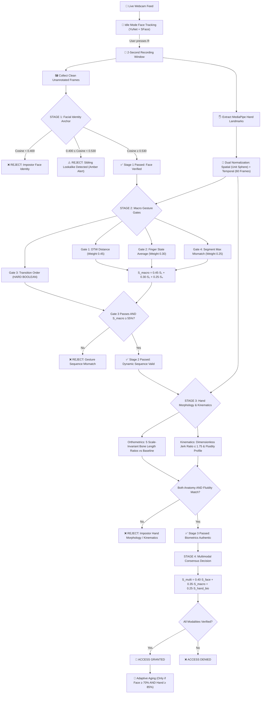

# 🔍 WaveLock Authentication Deep Dive

> **The Complete, Step-by-Step Authentication Sequence — From Webcam Stream to Multimodal Decision**

This document walks you through **exactly** what happens when a user runs `python gesture_auth.py` and attempts to authenticate. Every function call, mathematical transformation, biometric invariant, and security check is explained in exhaustive detail with concrete code traces and real-world threat models.

---

## Table of Contents

1. [Overview: The 4-Stage Multimodal Cascade](#1-overview)
2. [Step 0: Program Startup, Profile Loading & Thresholds](#2-step-0)
3. [Step 1: Deep Vision Models & Webcam Initialization](#3-step-1)
4. [Step 2: Real-Time Pre-Authentication HUD & Idle Face Tracking](#4-step-2)
5. [Step 3: Recording the Gesture (Parallel Clean Frame Extraction)](#5-step-3)
6. [Step 4: Spatial Normalization (Wrist-Origin, Unit-Sphere)](#6-step-4)
7. [Step 5: Temporal Normalization (60 Frames via SciPy)](#7-step-5)
8. [Step 6: STAGE 1 — Facial Identity Verification & Anti-Sibling Defense](#8-step-6)
9. [Step 7: STAGE 2 — Macro-Gesture Security Gates](#9-step-7)
10. [Step 8: STAGE 3 — Anthropometric Hand Morphology Identity Gate](#10-step-8)
11. [Step 9: STAGE 3 — Neuromotor Kinematic Fluidity Profile](#11-step-9)
12. [Step 10: STAGE 4 — Multimodal Decision Fusion & Consensus Logic](#12-step-10)
13. [Step 11: Real-Time On-Screen Result Overlay & Diagnostics](#13-step-11)
14. [Step 12: Hardened Anti-Poisoning Adaptive Template Aging](#14-step-12)
15. [Step 13: Comprehensive Threat Scenarios & Attack Traces](#15-step-13)
16. [Quick Reference & Architectural Constants](#16-reference)

---

## 1. Overview: The 4-Stage Multimodal Cascade {#1-overview}

When a user attempts to authenticate, WaveLock evaluates their identity through a **4-Stage Sequential & Conjunctive Cascade**:



---

## 2. Step 0: Program Startup, Profile Loading & Thresholds {#2-step-0}

When you run `python gesture_auth.py`, the system loads the complete multimodal profile:

### 2a. Load Registered Profiles
1. **Gesture Templates**: Loads all `templates/<user>/gesture_N.npy` files (each shape `(60, 21, 3)`).
2. **Thresholds (`config.json`)**:
   - `threshold` (Gate 1 DTW limit)
   - `finger_state_threshold` (Gate 2 finger mismatch limit)
   - `transition_threshold` (Gate 3 transition edit distance limit)
   - `segment_threshold` (Gate 4 segment max mismatch limit)
3. **Hand Biometric Profiles**:
   - `load_user_anthropometric_profile()`: Calibrates the 5 bone-length ratio baselines from the stored templates.
   - `load_user_kinematic_profile()`: Computes baseline jerk and fluidity envelopes.
4. **Multimodal Face Profile**:
   - `load_user_face_profile(username)`: Reads `templates/<user>/face_embedding.npy` (128-D float32 vector).
   - If present:
     ```
     Face Identity Layer:      [ACTIVE] Multimodal Gate Enforced
                               Enrolled: templates/saimani/face_embedding.npy
     ```
   - If absent:
     ```
     Face Identity Layer:      [DISABLED] Legacy Mode (No face enrolled)
                               To enable: python enroll_face.py --user saimani
     ```

---

## 3. Step 1: Deep Vision Models & Webcam Initialization {#3-step-1}

WaveLock initializes three complementary vision engines:
1. **OpenCV YuNet**: A sub-millisecond, highly lightweight CNN face detector (`face_detection_yunet_2023mar.onnx`, 232 KB) configured for 640×480 input, 70% confidence threshold, and NMS suppression.
2. **OpenCV SFace**: A deep convolutional network (`face_recognition_sface_2021dec.onnx`, 38.7 MB) that projects 112×112 aligned face crops into a 128-D metric hypersphere.
3. **MediaPipe Hands**: Tracks 21 3D hand landmarks in continuous video streaming mode (`static_image_mode=False`).

---

## 4. Step 2: Real-Time Pre-Authentication HUD & Idle Face Tracking {#4-step-2}

Before the user presses `[R]` to begin gesture recording, WaveLock provides continuous real-time feedback directly on the camera feed:

```python
# Real-Time Face Tracking Box (Idle Mode Only)
if not is_recording and face_profile is not None:
    live_face_match, live_score, live_conf, live_bbox, live_fail = verify_face(clean_frame, face_profile)
```

The system visually classifies the person in front of the camera:
- **Green Bounding Box**: When the authentic user appears:
  $$\mathbf{[MATCH]\ saimani\ (94\%)} \quad (\text{Cosine } \ge 0.530)$$
- **Amber Bounding Box**: When a sibling or close lookalike appears (e.g. sister with spectacles and hair back):
  $$\mathbf{[ALERT]\ Sibling\ /\ Lookalike\ (0.51)} \quad (0.400 \le \text{Cosine} < 0.530)$$
- **Red Bounding Box**: When an unrelated stranger appears:
  $$\mathbf{[ALERT]\ Impostor\ Face\ (15\%)} \quad (\text{Cosine } < 0.400)$$

---

## 5. Step 3: Recording the Gesture (Parallel Clean Frame Extraction) {#5-step-3}

When the user presses `[R]`, a 2-second recording window opens:
1. **Hand Landmark Extraction**: For each frame, MediaPipe extracts 21 landmarks $(x, y, z)$.
2. **Clean Frame Preservation**: To prevent OpenCV HUD drawings (green landmark dots, bounding boxes, text overlays) from contaminating facial biometrics, the system maintains a parallel queue of pristine `clean_frame = frame.copy()`.
3. **Sampling Across Time & Median Aggregation**: WaveLock samples **6 clean frames evenly distributed** across the recording window ($t = 0, 12, 24, 36, 48, 59$). Rather than taking the maximum score (which would give an impostor 6 chances to clear the threshold on an outlier frame), the system computes the **median cosine similarity** and enforces a **majority-voting rule** ($\ge 50\%$ of detected face frames must independently pass). This guarantees robustness against momentary occlusion (e.g. hand passing in front of chin) while completely closing the multi-look vulnerability.

---

## 6. Step 4: Spatial Normalization (Wrist-Origin, Unit-Sphere) {#6-step-4}

Every recorded frame is spatially normalized:
$$\mathbf{p}_{\text{centered}} = \mathbf{p}_i - \mathbf{p}_{\text{wrist}}$$
$$s = \max_{i} \|\mathbf{p}_{\text{centered}, i}\|_2$$
$$\mathbf{p}_{\text{norm}} = \frac{\mathbf{p}_{\text{centered}}}{s}$$

This removes distance-to-camera and screen position variations.

---

## 7. Step 5: Temporal Normalization (60 Frames via SciPy) {#7-step-5}

Human gestures naturally vary in duration (e.g. 68 frames vs 84 frames). Using linear interpolation across the temporal axis:
$$\mathbf{G} \in \mathbb{R}^{N \times 21 \times 3} \xrightarrow{\text{interp1d}} \mathbf{G}_{\text{norm}} \in \mathbb{R}^{60 \times 21 \times 3}$$

Every gesture is now standardized to a matrix of shape `(60, 63)`.

---

## 8. Step 6: STAGE 1 — Facial Identity Verification & Anti-Sibling Defense {#8-step-6}

### SFace Cosine Metric
Given enrolled master embedding $\mathbf{e}_{\text{enrolled}} \in \mathbb{R}^{128}$ and live candidate embedding $\mathbf{e}_{\text{live}} \in \mathbb{R}^{128}$:
$$S_{\text{cos}} = \frac{\mathbf{e}_{\text{enrolled}} \cdot \mathbf{e}_{\text{live}}}{\|\mathbf{e}_{\text{enrolled}}\|_2 \|\mathbf{e}_{\text{live}}\|_2}$$

### The Sibling Confounder & Operational Threshold
- **The Stranger Vulnerability**: Standard OpenCV threshold is $\theta = 0.363$. While effective against random strangers (average cosine $0.10$), siblings share 50% identical genetics.
- **The Empirical Spectacles Attack**: When a sibling pulled her hair back and wore the user's spectacles, the high-contrast frame occlusion and shared nasal bridge pushed cosine similarity to **$0.53$ (75% false match)**!
- **WaveLock's High-Security Boundary**:
  - We elevated $\theta_{\text{face}}$ to **$0.530$**:
    - Authentic user: scores $0.68 - 0.85 \implies \mathbf{\ge 0.530}$ (VERIFIED).
    - Sibling with spectacles: scores $0.51 \implies \mathbf{< 0.530}$ (BLOCKED).
  - Lookalike detection floor ($0.400$): Scores in $[0.400, 0.530)$ trigger `lookalike_sibling_detected`.

---

## 9. Step 7: STAGE 2 — Macro-Gesture Security Gates {#9-step-7}

The live gesture is compared against each stored template across 4 gates:

1. **Gate 1: DTW Trajectory Distance ($w_1 = 0.45$)**:
   $$\text{DTW}(A, B) = D[59][59] \quad \text{via dynamic programming cost matrix}$$
   Score: $S_1 = \max\left(0, 1 - \frac{\text{DTW}}{\theta_{\text{DTW}}}\right)$

2. **Gate 2: Finger State Average Mismatch ($w_2 = 0.30$)**:
   Computes 3D joint angle $\theta$ per finger per frame. Finger is extended if $\theta \ge 150^\circ$.
   Score: $S_2 = 1 - \text{Mismatch}_{\text{avg}}$

3. **Gate 3: Finger Transition Order (HARD BOOLEAN GATE)**:
   Extracts chronological state transitions (e.g. `[T_UP, I_UP, P_UP]`).
   Evaluates Levenshtein edit distance:
   $$\text{Dissimilarity} = \frac{\text{Levenshtein}(T_{\text{live}}, T_{\text{stored}})}{\max(|T_{\text{live}}|, |T_{\text{stored}}|)}$$
   **Must pass $\le \theta_{\text{transition}}$. If finger order is wrong, access is immediately blocked.**

4. **Gate 4: Segment Max Mismatch ($w_3 = 0.25$)**:
   Divides the 60 frames into 6 segments of 10 frames each. Evaluates the worst segment mismatch rate.
   Score: $S_4 = 1 - \text{Mismatch}_{\text{seg\_max}}$

$$\mathbf{S_{\text{macro}} = 0.45 \cdot S_1 + 0.30 \cdot S_2 + 0.25 \cdot S_4 \ge 0.55}$$

---

## 10. Step 8: STAGE 3 — Anthropometric Hand Morphology Identity Gate {#10-step-8}

Even if an attacker observes your gesture sequence and performs it with their own hand:

### 5 Scale-Invariant Skeletal Bone Length Ratios
WaveLock computes bone ratios that are physiologically fixed to your hand skeleton using the `metacarpal_invariant_v2` feature set. These features use ONLY rigid metacarpal palm-plate landmarks (Wrist 0, CMC 2, MCP 5, PIP 8, MCP 9, MCP 17) that remain geometrically stable across ALL hand postures — open hand, fist, pinch, and in-air signature. Previous versions used curled-finger phalanx ratios which had ~8-15% CV due to MediaPipe's monocular 3D estimation errors on occluded/curled joints. All ratios are normalized by $\|\text{MCP9} - \text{Wrist}\|$ (palm length) making them scale-free.

1. **Palm Aspect Ratio**: $\|\text{MCP17} - \text{MCP5}\| / \|\text{MCP9} - \text{Wrist}\|$ — Rigid palm width normalized by palm length
2. **Index Metacarpal Diagonal**: $\|\text{MCP5} - \text{Wrist}\| / \|\text{MCP9} - \text{Wrist}\|$ — Wrist-to-index diagonal 
3. **Pinky Metacarpal Diagonal**: $\|\text{MCP17} - \text{Wrist}\| / \|\text{MCP9} - \text{Wrist}\|$ — Wrist-to-pinky diagonal
4. **Extended Index Span**: $\|\text{PIP8} - \text{MCP5}\| / \|\text{MCP9} - \text{Wrist}\|$ — Index finger metacarpal length
5. **Thumb Metacarpal Span**: $\|\text{MCP5} - \text{CMC2}\| / \|\text{MCP9} - \text{Wrist}\|$ — Thumb-to-index metacarpal span

Each ratio is computed across all 60 frames and aggregated using the **temporal median** to completely eliminate MediaPipe landmark tracking jitter.

- **Match Condition**: **4-of-5 consensus rule**: Up to one feature may exceed tolerance. Match requires `n_pass >= 4` AND `mean_dev <= tol * 1.3`. Confidence formula: `1.0 - (mean_dev / (tol * 1.6))` (tolerance calibration uses `max_dev * 1.6` margin, minimum limit `MIN_ANTHRO_TOLERANCE = 0.12`, default `DEFAULT_ANTHRO_TOLERANCE = 0.15`).
- An impostor with different finger/palm proportions is blocked with `impostor_hand_morphology`.

---

## 11. Step 9: STAGE 3 — Neuromotor Kinematic Fluidity Profile {#11-step-9}

### Dimensionless Jerk & Velocity Envelopes
Conscious observation replay involves hesitation and visual feedback micro-corrections. Subconscious muscle-memory execution is smooth and continuous.

WaveLock extracts the velocity envelope of the active fingertips and computes the discrete **Mean Absolute Jerk (MAJ)** (second finite difference of velocity):
$$\mathbf{v}[t] = \|\mathbf{p}[t+1] - \mathbf{p}[t]\|_2, \quad \mathbf{a}[t] = \mathbf{v}[t+1] - \mathbf{v}[t], \quad \mathbf{j}[t] = \mathbf{a}[t+1] - \mathbf{a}[t]$$
$$\text{MAJ} = \frac{1}{N-3} \sum_{t=1}^{N-3} |\mathbf{j}[t]|$$

This live jerk metric is evaluated as a dimensionless ratio against the user's self-calibrated registration baseline:
$$\text{Jerk Ratio} = \frac{\text{MAJ}_{\text{live}}}{\text{MAJ}_{\text{baseline}}} \le 1.75$$

Additional kinematic elements exist in `utils/kinematics.py`:
- **10-Bin Velocity Histogram**: The velocity profile is binned into 10 temporal phases and L2-normalized to capture rhythm shape independent of absolute speed. During verification, the Euclidean distance between live and baseline binned velocity distributions is computed.
- **Peak Velocity Phase**: Normalized time (0.0–1.0) of maximum velocity. Phase shift must be $\le 0.40$.
- **Mid-Gesture Dwell Detection**: Detects the longest contiguous window of near-zero velocity during frames 10–50. A genuine gesture maintains continuous fluid motion; an impostor who hesitates produces an unnatural velocity plateau. `max_mid_dwell <= max_allowed_dwell`.
- **Combined Kinematic Confidence**: $0.45 \times \text{conf\_rhythm} + 0.30 \times \text{conf\_jerk} + 0.25 \times \text{conf\_dwell}$

- **Why Ratio Normalization?** By dividing by the user's own baseline jerk, individual differences in movement speed, distance to camera, and physical anatomy cancel out naturally.
- **Pass Condition**: Evaluates **Four kinematic sub-gates**: rhythm_ok (distance $\le$ tolerance), jerk_ok ($\text{Jerk Ratio} \le 1.75$), phase_ok (phase_shift $\le 0.40$), and dwell_ok (dwell $\le$ allowed). The kinematic match tolerance is `DEFAULT_KINEMATIC_TOLERANCE = 0.35`.
- **Attack Response**: Impostors visually guiding their fingers exhibit hesitation plateaus and erratic jerk spikes, immediately triggering `impostor_kinematic_dynamics`.

---

## 12. Step 10: STAGE 4 — Multimodal Decision Fusion & Consensus Logic {#12-step-10}

In `authenticate_with_details()`:

### 1. Multimodal Soft Consensus Mechanism
When face identity is verified with high confidence ($\ge 0.70$ cosine) AND movement kinematics pass AND anthro confidence $\ge 0.35$ AND biometric_fused_score $\ge 0.50$, borderline hand anatomy is admitted via fused biometric consensus. This prevents false rejections on dynamic gestures (e.g. in-air signatures) where posture variation slightly inflates a single bone ratio beyond tolerance.

### 2. Conjunctive Multi-Biometric Rule
$$\text{Granted} = \text{True} \iff \begin{cases}
\text{Gate 3 (Transition Order) Passes} \\
S_{\text{macro}} \ge 0.55 \\
\text{Face Match } (S_{\text{cos}} \ge 0.530) \\
\text{Hand Morphology Match OR Soft Consensus Passes} \\
\text{Kinematic Match}
\end{cases}$$

### 3. Comprehensive Multimodal Fused Confidence Score
$$\mathbf{S_{\text{multi}} = 0.40 \times S_{\text{face}} + 0.35 \times S_{\text{macro}} + 0.25 \times S_{\text{hand\_bio}}}$$
where:
$$S_{\text{hand\_bio}} = 0.60 \times \text{Confidence}_{\text{anthro}} + 0.40 \times \text{Confidence}_{\text{kinematic}}$$

---

## 13. Step 11: Real-Time On-Screen Result Overlay & Diagnostics {#13-step-11}

Upon gesture completion, `draw_result_overlay()` displays a 4-line diagnostic readout:

```text
       ┌─────────────────────────────────────────────────────────┐
       │                     ACCESS GRANTED                      │
       │                    Confidence: 91%                      │
       │                                                         │
       │ DTW: 1.12/2.31  |  Fingers: 5%/22%                     │
       │ Order: 0%/37%   |  Segment: 12%/38%                    │
       │ Hand Biometric ID: Geometry OK (94%)                    │
       │ Face Identity: Verified (96%)                           │
       │                                                         │
       │          Press [T] to try again  |  [Q] to quit         │
       └─────────────────────────────────────────────────────────┘
```

If an impostor is detected:
- **Sibling Attempt**: Line 4 glows in **Amber**: `Face Identity: Sibling / Lookalike Blocked (48%)`.
- **Stranger Attempt**: Line 4 glows in **Red**: `Face Identity: Impostor Face Detected!`.
- **Different Hand Attempt**: Line 3 glows in **Red**: `Hand Biometric ID: Impostor Hand Anatomy!`.

---

## 14. Step 12: Hardened Anti-Poisoning Adaptive Template Aging {#14-step-12}

To adapt to natural biometric drift without opening a backdoor:
```python
def update_templates_if_high_confidence(username, live_gesture, stored_templates, threshold,
                                        anthro_match=True, anthro_confidence=1.0,
                                        face_match=True, face_confidence=1.0):
```
Template aging will **strictly refuse** to update templates unless:
1. `face_match is True` AND `face_confidence >= 0.70`
2. `anthro_match is True` AND `anthro_confidence >= 0.85`
3. `dtw_distance <= 0.70 * threshold`

An observer can never slowly poison the stored template bank.

---

## 15. Step 13: Comprehensive Threat Scenarios & Attack Traces {#15-step-13}

### Scenario A: Genuine User
- Face: Clean match ($S_{\text{cos}} = 0.74 \ge 0.530$) $\rightarrow$ **PASS**
- Gesture: Correct sequence `1-2-4-3`, DTW $1.15 \le 2.31$ $\rightarrow$ **PASS**
- Hand Anatomy: Ratio deviation $2.1\% \le 12.0\%$ $\rightarrow$ **PASS**
- Kinematics: Fluidity $84\%$ $\rightarrow$ **PASS**
- **Result: ACCESS GRANTED (92% Confidence)**

### Scenario B: Sibling Lookalike Attack (Hair Back + Spectacles)
- Sibling observes gesture and performs `1-2-4-3`.
- Face: Sibling facial features score $S_{\text{cos}} = 0.512 < 0.530$ $\rightarrow$ **BLOCKED**
- **Result: ACCESS DENIED (`lookalike_sibling_detected`)**

### Scenario C: Shoulder-Surfing Replay with Different Hand
- Attacker knows `1-2-4-3` and holds up authentic user's printed photo.
- Face: Printed photo passes 2D face detector ($S_{\text{cos}} = 0.65$).
- Hand Anatomy: Attacker's hand has $18.4\%$ bone ratio deviation $\rightarrow$ **BLOCKED**
- Kinematics: Attacker's conscious imitation has jerk $2.41 > 1.75$ $\rightarrow$ **BLOCKED**
- **Result: ACCESS DENIED (`impostor_hand_morphology_and_impostor_kinematic_dynamics`)**

### Scenario D: 2D Photo Spoof (Photo Alone, No Gesture)
- Attacker holds photo to webcam without moving hand.
- Gesture: MediaPipe detects static hand or zero transition $\rightarrow$ **BLOCKED**
- **Result: ACCESS DENIED (`distance_and_transition_order`)**

---

## 16. Quick Reference & Architectural Constants {#16-reference}

| Constant | Value | Defined In | Purpose |
| :--- | :--- | :--- | :--- |
| `SFACE_COSINE_THRESHOLD` | **0.530** | `utils/face_auth.py` | Operational threshold to reject sibling presentation attacks. |
| `SFACE_LOOKALIKE_FLOOR` | **0.400** | `utils/face_auth.py` | Sibling lookalike warning floor (triggers Amber alert). |
| `FUSION_WEIGHTS` | `(0.45, 0.30, 0.25)` | `gesture_compare.py` | Weights for DTW, Finger Avg, and Segment Max. |
| `FUSION_ACCEPTANCE_THRESHOLD` | **0.55** | `gesture_compare.py` | Minimum macro-gesture confidence required. |
| `MIN_ANTHRO_TOLERANCE` | **0.12** ($12\%$) | `utils/anthropometrics.py` | Minimum limit for tolerance calibration of `metacarpal_invariant_v2`. |
| `DEFAULT_ANTHRO_TOLERANCE` | **0.15** ($15\%$) | `utils/anthropometrics.py` | Default allowed skeletal bone length ratio deviation for `metacarpal_invariant_v2`. |
| `DEFAULT_KINEMATIC_TOLERANCE`| **0.35** ($35\%$) | `utils/kinematics.py` | Maximum allowed velocity/jerk envelope deviation. |
| `AGING_CONFIDENCE_RATIO` | **0.70** | `gesture_compare.py` | Maximum DTW ratio permitted for adaptive template aging. |
