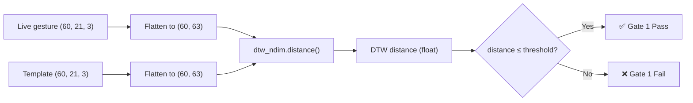

# 🧮 Dynamic Time Warping — Complete Algorithm Deep Dive

> **Phase 1: Understanding the Algorithm | Phase 2: How It Works in WaveLock**

---

# Phase 1: The DTW Algorithm — From First Principles

## 1.1 What Problem Does DTW Solve?

Imagine you want to compare two temporal sequences — for example, two audio recordings of the same word, or two handwriting strokes, or two hand gestures. The naive approach is to compare them **point by point**: compare frame 1 of sequence A with frame 1 of sequence B, frame 2 with frame 2, and so on.

But this breaks immediately when the sequences have different speeds.

### The Speed Problem

Say two people say the word "hello":

```
Person A (slow):   h--e--l--l--o
Person B (fast):   h-e-l-l-o

Frame indices:     1  2  3  4  5  6  7  8  9 10
Person A:          h  h  e  e  l  l  l  l  o  o
Person B:          h  e  l  l  o  o  -  -  -  -
```

If you compare frame-by-frame:
- Frame 3: A says "e", B says "l" → **mismatch!**
- Frame 5: A says "l", B says "o" → **mismatch!**

They said the same word, but frame-by-frame comparison fails because one spoke faster.

**Dynamic Time Warping solves this** by finding the optimal alignment between the two sequences. It can "warp" time — stretching or compressing portions of one sequence to best match the other.

---

## 1.2 The Core Idea: Finding the Best Alignment

Instead of forcing frame 1 to match frame 1, DTW asks: **"What is the cheapest way to align these two sequences?"**

It allows three types of alignment moves:
1. **Match**: Advance both sequences (diagonal move)
2. **Expand A**: Hold A's position, advance B (A is slower here)
3. **Expand B**: Advance A, hold B's position (B is slower here)

### Visual Example

Two short 1-dimensional sequences:

```
Sequence A: [1, 3, 5, 8, 9]        (5 elements)
Sequence B: [1, 5, 8, 9]           (4 elements)
```

B is missing the value "3" — it jumped from 1 straight to 5. DTW finds the alignment:

```
A:  1  3  5  8  9
    |  |  |  |  |
B:  1  1  5  8  9
    ↑     ↑
    B's "1" aligns to    B jumps straight
    both A's "1" and     from 1 to 5 —
    A's "3"              DTW handles this
```

DTW aligned B's first element (1) with both A[0]=1 and A[1]=3, effectively "stretching" B to match A's slower start.

---

## 1.3 The Cost Matrix

DTW works by building a **cost matrix** (or distance matrix). Given:
- Sequence A with N elements: $a_1, a_2, \ldots, a_N$
- Sequence B with M elements: $b_1, b_2, \ldots, b_M$

The cost matrix $C$ has dimensions $N \times M$, where each cell $C[i][j]$ represents the **local cost** of aligning element $a_i$ with element $b_j$.

For numeric sequences, the local cost is typically the **absolute difference** or **Euclidean distance**:

$$C[i][j] = |a_i - b_j|$$

### Example Cost Matrix

Sequences: A = [1, 3, 5, 8, 9], B = [1, 5, 8, 9]

```
        B[0]=1  B[1]=5  B[2]=8  B[3]=9
A[0]=1  |  0      4       7       8
A[1]=3  |  2      2       5       6
A[2]=5  |  4      0       3       4
A[3]=8  |  7      3       0       1
A[4]=9  |  8      4       1       0
```

Cell (0,0) = |1-1| = 0 (perfect match)
Cell (1,0) = |3-1| = 2 (moderate cost)
Cell (2,1) = |5-5| = 0 (perfect match)

---

## 1.4 The Accumulated Cost Matrix (DP Table)

The cost matrix tells us the cost of individual pairings. But we need the **total cost of the best alignment path** from the top-left to the bottom-right.

DTW uses **dynamic programming** to build an accumulated cost matrix $D$ where:

$$D[i][j] = C[i][j] + \min\begin{cases} D[i-1][j-1] & \text{(match: advance both)} \\ D[i-1][j] & \text{(expand A: advance A only)} \\ D[i][j-1] & \text{(expand B: advance B only)} \end{cases}$$

**Base cases:**
$$D[0][0] = C[0][0]$$
$$D[i][0] = C[i][0] + D[i-1][0] \quad \text{(first column: can only come from above)}$$
$$D[0][j] = C[0][j] + D[0][j-1] \quad \text{(first row: can only come from left)}$$

### Worked Example: Building the DP Table

Using our cost matrix:

**Step 1: Initialize D[0][0]**
$$D[0][0] = C[0][0] = 0$$

**Step 2: Fill first row**
$$D[0][1] = C[0][1] + D[0][0] = 4 + 0 = 4$$
$$D[0][2] = C[0][2] + D[0][1] = 7 + 4 = 11$$
$$D[0][3] = C[0][3] + D[0][2] = 8 + 11 = 19$$

**Step 3: Fill first column**
$$D[1][0] = C[1][0] + D[0][0] = 2 + 0 = 2$$
$$D[2][0] = C[2][0] + D[1][0] = 4 + 2 = 6$$
$$D[3][0] = C[3][0] + D[2][0] = 7 + 6 = 13$$
$$D[4][0] = C[4][0] + D[3][0] = 8 + 13 = 21$$

**Step 4: Fill the rest row by row**

For $D[1][1]$:
$$D[1][1] = C[1][1] + \min(D[0][0], D[0][1], D[1][0]) = 2 + \min(0, 4, 2) = 2 + 0 = 2$$

For $D[1][2]$:
$$D[1][2] = C[1][2] + \min(D[0][1], D[0][2], D[1][1]) = 5 + \min(4, 11, 2) = 5 + 2 = 7$$

For $D[1][3]$:
$$D[1][3] = C[1][3] + \min(D[0][2], D[0][3], D[1][2]) = 6 + \min(11, 19, 7) = 6 + 7 = 13$$

Continuing this process for all cells:

```
Accumulated Cost Matrix D:

          B[0]=1  B[1]=5  B[2]=8  B[3]=9
A[0]=1  |   0       4      11      19
A[1]=3  |   2       2       7      13
A[2]=5  |   6       2       5       9
A[3]=8  |  13       5       2       3
A[4]=9  |  21       9       3       2   ← DTW distance
```

**The DTW distance is $D[N-1][M-1] = D[4][3] = 2$**

---

## 1.5 The Warping Path

The DTW distance tells us "how similar are these sequences overall?" (lower = more similar). But we can also trace back through the DP table to find **which elements aligned with which**. This is called the **warping path**.

Starting at $D[4][3]$, at each cell we go to the neighbor (diagonal, left, or above) that gave us the minimum:

```
D[4][3] = 2 ← came from D[3][2] = 2    (diagonal: match)
D[3][2] = 2 ← came from D[2][1] = 2    (diagonal: match)
D[2][1] = 2 ← came from D[1][1] = 2    (diagonal: match)
D[1][1] = 2 ← came from D[0][0] = 0    (diagonal: match)
D[0][0] = 0 ← start

Warping path: (0,0) → (1,1) → (2,1) → (3,2) → (4,3)
```

Wait — step (1,1) → (2,1) goes **down** (same B index), meaning B[1]=5 aligned with both A[1]=3 and A[2]=5. This is the "expansion" that handles B being shorter than A.

### Visualizing the Alignment

```
A[0]=1  ──── B[0]=1     cost: |1-1| = 0
A[1]=3  ──┐
           ├─ B[1]=5    cost: |3-5| + |5-5| = 2 + 0
A[2]=5  ──┘
A[3]=8  ──── B[2]=8     cost: |8-8| = 0
A[4]=9  ──── B[3]=9     cost: |9-9| = 0

Total DTW distance = 0 + 2 + 0 + 0 + 0 = 2
```

---

## 1.6 Constraints on the Warping Path

Not every path through the matrix is valid. The warping path must satisfy three constraints:

### Constraint 1: Boundary
The path must start at (0, 0) and end at (N-1, M-1). Both sequences must be covered completely.

### Constraint 2: Monotonicity
The path can only move **forward** in time. You cannot go backward:
$$i_{k+1} \geq i_k \text{ and } j_{k+1} \geq j_k$$

### Constraint 3: Step Size
Each step moves at most one cell in each direction:
$$(i_{k+1} - i_k, j_{k+1} - j_k) \in \{(1,0), (0,1), (1,1)\}$$

This means:
- **(1,1)**: Both sequences advance (diagonal = match)
- **(1,0)**: Only A advances (A is expanded)
- **(0,1)**: Only B advances (B is expanded)

---

## 1.7 Multi-Dimensional DTW

So far, each element was a single number. But in real applications, each element is often a **vector**. For example, a hand gesture frame has 63 features (21 landmarks × 3 coordinates).

The only change is in the **local cost function**. Instead of absolute difference, use **Euclidean distance** between vectors:

$$C[i][j] = \sqrt{\sum_{k=1}^{d} (a_{i,k} - b_{j,k})^2}$$

where $d$ is the dimensionality (63 in our case).

Everything else — the DP recurrence, the warping path, the constraints — stays exactly the same.

### Example: 2D DTW

Sequences of 2D points:

```
A = [(0,0), (1,2), (3,4)]
B = [(0,1), (2,3), (3,5)]

C[0][0] = sqrt((0-0)² + (0-1)²) = sqrt(1) = 1.0
C[0][1] = sqrt((0-2)² + (0-3)²) = sqrt(13) = 3.61
C[1][1] = sqrt((1-2)² + (2-3)²) = sqrt(2) = 1.41
...
```

---

## 1.8 Time Complexity

**Time:** $O(N \times M)$ — filling the entire DP table.
**Space:** $O(N \times M)$ — storing the DP table.

For our system: $N = M = 60$ frames, so that's $60 \times 60 = 3{,}600$ cells. With 63-dimensional vectors, each cell computation involves a 63-dimensional Euclidean distance. Total: ~3,600 × 63 ≈ 227,000 floating-point operations per comparison. This is very fast — less than 1 millisecond on modern hardware.

---

## 1.9 DTW vs Simple Euclidean Distance

| Property | Euclidean Distance | DTW |
|----------|-------------------|-----|
| Speed tolerance | None — sequences must be same length | Handles different speeds via warping |
| Length requirement | Must be identical | Can differ |
| Alignment | Rigid 1:1 mapping | Flexible many-to-one |
| Computation | $O(N \times d)$ | $O(N \times M \times d)$ |
| Use case | Static patterns | Temporal sequences |

**DTW is the right choice for gesture comparison** because humans never perform a gesture at exactly the same speed. The beginning might be fast, the middle slow, and the end fast — DTW handles this naturally.

---

# Phase 2: How DTW Is Used in WaveLock

## 2.1 Where DTW Fits in the Architecture

DTW is **Gate 1** of the 4-gate security system. It is the first and broadest check — it evaluates whether the overall 3D motion trajectory of the live gesture resembles the stored templates.



---

## 2.2 The `compute_dtw_distance()` Function

Here is the exact function from [gesture_compare.py](file:///c:/Users/asus/Desktop/final%20year%20-%20Copy/gesture_auth_project/gesture_compare.py#L107-L125):

```python
def compute_dtw_distance(gesture_a, gesture_b):
    # Step 1: Flatten (60, 21, 3) → (60, 63)
    flat_a = gesture_a.reshape(gesture_a.shape[0], -1).astype(np.float64)
    flat_b = gesture_b.reshape(gesture_b.shape[0], -1).astype(np.float64)

    # Step 2: Compute multi-dimensional DTW
    distance = dtw_ndim.distance(flat_a, flat_b)
    return distance
```

### Step 1: The Flattening

Each gesture is stored as `(60, 21, 3)` — 60 frames, 21 landmarks, 3 coordinates.

The `.reshape(60, -1)` flattens the last two dimensions:

```
Before flattening — Frame 0 of gesture:
  Landmark  0: [0.000, 0.000, 0.000]  (wrist)
  Landmark  1: [0.034, -0.118, -0.024]
  Landmark  2: [0.068, -0.210, -0.033]
  ...
  Landmark 20: [0.144, -0.708, -0.144]

After flattening — Frame 0 is now a single vector of 63 numbers:
  [0.000, 0.000, 0.000, 0.034, -0.118, -0.024, 0.068, -0.210, -0.033, ..., 0.144, -0.708, -0.144]
   ↑ lm0_x  lm0_y  lm0_z  lm1_x   lm1_y   lm1_z  lm2_x   lm2_y   lm2_z         lm20_x lm20_y lm20_z
```

The result is `(60, 63)` — 60 time steps, each described by a 63-dimensional feature vector.

### Step 2: The DTW Library

WaveLock uses the `dtaidistance` library (a C-optimized DTW implementation from KU Leuven university):

```python
from dtaidistance import dtw_ndim

distance = dtw_ndim.distance(flat_a, flat_b)
```

This internally:
1. Builds the $60 \times 60$ cost matrix using 63-dimensional Euclidean distance at each cell
2. Fills the accumulated cost DP table using the standard recurrence
3. Returns $D[59][59]$ — the DTW distance

All of this happens in optimized C code, taking less than 1 millisecond.

---

## 2.3 What Does the DTW Distance Number Mean?

The DTW distance is the **accumulated alignment cost** when optimally matching the 60 frames of the live gesture to the 60 frames of the template. Each cell contributes a 63-dimensional Euclidean distance.

### Distance Interpretation (From Real Data)

Using saimani's actual registration data:

| Pair | DTW Distance | What it means |
|------|-------------|---------------|
| Sample 4 vs Sample 5 | **0.8738** | Very similar — nearly identical performances |
| Sample 2 vs Sample 5 | **1.1028** | Similar — small natural variation |
| Sample 1 vs Sample 4 | **1.2393** | Similar — typical same-person variation |
| Sample 1 vs Sample 5 | **1.3030** | Moderate — normal variation |
| Sample 3 vs Sample 4 | **1.5378** | More variation — sample 3 was slightly different |
| Sample 2 vs Sample 3 | **2.0380** | Most variation — still the same gesture, just performed differently |

**General scale:**

| Distance Range | Meaning |
|----------------|---------|
| 0.0 | Identical gestures (impossible in practice due to sensor noise) |
| 0.5 – 1.5 | Very similar (same gesture, same person, typical variation) |
| 1.5 – 2.5 | Moderately similar (same gesture, noticeable variation) |
| 2.5 – 4.0 | Somewhat different (possibly wrong gesture or different person) |
| 4.0+ | Very different (clearly different gesture) |

---

## 2.4 DTW During Registration (Threshold Calibration)

During registration, DTW is used not for authentication but for **measuring your consistency**. The system computes the DTW distance between every pair of your 5 samples (10 pairs total).

```python
def compute_pairwise_distances(samples):
    pairwise_distances = []
    for i in range(len(samples)):
        for j in range(i + 1, len(samples)):
            d = compute_dtw_distance(samples[i], samples[j])
            pairwise_distances.append(d)
    return pairwise_distances
```

These 10 distances are then used to set the DTW threshold using `compute_threshold_details()`.

### The Threshold Formula (Real Data Walkthrough)

Using saimani's 10 pairwise distances:

```
distances = [1.2451, 2.0049, 1.2393, 1.3030, 2.0380,
             1.2710, 1.1028, 1.5378, 1.6516, 0.8738]
```

**Step 1: Statistics**

| Statistic | Value | Meaning |
|-----------|-------|---------|
| Mean | 1.4267 | Average distance between your samples |
| Std Dev | 0.3590 | How spread out your distances are |
| Median | 1.2870 | Middle value |
| P90 | 2.0082 | 90% of your pairs are below this |
| Max | 2.0380 | Worst pair |

**Step 2: Three candidate thresholds**

$$\text{statistical} = \mu + 2\sigma = 1.4267 + 2 \times 0.359 = 2.1448$$

$$\text{percentile} = P_{90} \times 1.15 = 2.0082 \times 1.15 = 2.3094$$

$$\text{max\_margin} = \max \times 1.25 = 2.038 \times 1.25 = 2.5475$$

**Step 3: Select the final threshold**

$$\text{threshold} = \min\Big(\max(\text{statistical}, \text{percentile}), \text{max\_margin}\Big)$$

$$= \min\Big(\max(2.1448, 2.3094), 2.5475\Big)$$

$$= \min(2.3094, 2.5475) = 2.3094$$

**Step 4: Apply floor**

$$\text{threshold} = \max(2.0, 2.3094) = \mathbf{2.3094}$$

> [!IMPORTANT]
> **Why use the percentile-based threshold instead of just max × 1.5?** The old method (`max × 1.5 = 3.06`) would be too permissive — it would accept gestures with DTW distance up to 3.06, which is well into "different gesture" territory. The statistical method produces a tighter threshold (2.31) that still covers your natural variation but is much harder to fool.

### The Consistency Score

The system also computes a "consistency score" as a quality metric:

$$\text{consistency} = 100 \times \left(1 - \frac{\sigma}{\mu}\right) = 100 \times \left(1 - \frac{0.359}{1.427}\right) = 74.83$$

This tells you: "Your gesture performances are 74.83% consistent." The lower the standard deviation relative to the mean, the more consistent you are, and the tighter (more secure) your threshold becomes.

---

## 2.5 DTW During Authentication

When a user tries to authenticate, the live gesture is compared against ALL 5 stored templates:

```python
for i, template in enumerate(stored_templates):
    distance = compute_dtw_distance(live_gesture, template)
    passes_distance = (distance <= threshold)   # e.g., <= 2.3094
```

**The live gesture only needs to pass Gate 1 for ONE template** (the one it matches best). This is because even during registration, your 5 samples differ from each other — the live attempt will naturally be closer to some templates than others.

### Real Authentication Example

**Correct gesture attempt by saimani:**
```
Live vs Template 1: distance = 1.45  ← passes (1.45 ≤ 2.31)
Live vs Template 2: distance = 1.78  ← passes (1.78 ≤ 2.31)
Live vs Template 3: distance = 2.15  ← passes (2.15 ≤ 2.31)
Live vs Template 4: distance = 1.12  ← passes (1.12 ≤ 2.31) ★ best match
Live vs Template 5: distance = 1.09  ← passes (1.09 ≤ 2.31)

Best match: Template 5, distance = 1.09 → Gate 1 PASSES
```

**Wrong gesture attempt by attacker:**
```
Live vs Template 1: distance = 4.82  ← fails (4.82 > 2.31)
Live vs Template 2: distance = 5.11  ← fails
Live vs Template 3: distance = 4.95  ← fails
Live vs Template 4: distance = 4.67  ← fails
Live vs Template 5: distance = 4.89  ← fails

Best match: Template 4, distance = 4.67 → Gate 1 FAILS
```

**Similar gesture "1-2-3" attack (missing ring finger):**
```
Live vs Template 1: distance = 2.11  ← passes (2.11 ≤ 2.31) ⚠️
Live vs Template 2: distance = 2.25  ← passes (2.25 ≤ 2.31) ⚠️
Live vs Template 3: distance = 1.98  ← passes (1.98 ≤ 2.31) ⚠️
Live vs Template 4: distance = 2.09  ← passes (2.09 ≤ 2.31) ⚠️
Live vs Template 5: distance = 2.18  ← passes (2.18 ≤ 2.31) ⚠️

Best match: Template 3, distance = 1.98 → Gate 1 PASSES ⚠️
```

> [!WARNING]
> **This is why DTW alone is not enough!** The "1-2-3" attack passes Gate 1 because the overall hand trajectory is very similar — you're still raising fingers in roughly the same direction. The missing ring finger changes only ~10 frames out of 60. DTW absorbs this difference through time warping. This is why Gates 2, 3, and 4 exist.

---

## 2.6 Why DTW Can Be Fooled (And How the Other Gates Help)

DTW measures the **global alignment cost** of two trajectories. It excels at catching:
- Completely different gestures (waving vs pointing)
- Different hand motions (left-to-right vs up-and-down)
- Random hand movements

But DTW struggles with:
- Gestures that use the same overall motion but different fingers
- Gestures with the right fingers in the wrong order
- Gestures that are 90% correct but wrong in a small section

This is exactly why WaveLock uses 4 gates:

| Gate | What DTW Misses | How This Gate Catches It |
|------|----------------|--------------------------|
| Gate 2: Finger Avg | Wrong fingers used | Checks per-frame finger extension states |
| Gate 3: Transition Order | Right fingers, wrong order | Checks the sequence of finger raises via edit distance |
| Gate 4: Segment Max | Localized error | Checks the worst 10-frame segment instead of averaging |

**Together, they form a defense-in-depth strategy.** Each gate covers a blind spot of the others.

---

## 2.7 Quick Reference: DTW in WaveLock

| Aspect | Detail |
|--------|--------|
| **Library** | `dtaidistance` (C-optimized, from KU Leuven) |
| **Function** | `compute_dtw_distance()` in `gesture_compare.py` |
| **Input shape** | Two arrays of (60, 21, 3), flattened to (60, 63) |
| **Output** | Single float — lower means more similar |
| **Config key** | `threshold` in `config.json` |
| **Threshold floor** | 2.0 (prevents being too strict) |
| **Calibration method** | `statistical_v2`: max(mean+2σ, P90×1.15), capped at max×1.25 |
| **Role in auth** | Gate 1 of 4 — ALL must pass |
| **Speed** | < 1 ms per comparison (C-optimized) |
| **When it fails** | Catches completely different gestures |
| **When it can't help** | Similar trajectory but wrong fingers or wrong order |

### The Complete DTW Formula Used in WaveLock

Given two gestures $A$ and $B$, each with 60 frames of 63-dimensional feature vectors:

$$\text{DTW}(A, B) = D[59][59]$$

where:

$$D[i][j] = \left\| \vec{a}_i - \vec{b}_j \right\|_2 + \min\begin{cases} D[i-1][j-1] \\ D[i-1][j] \\ D[i][j-1] \end{cases}$$

$$D[0][0] = \left\| \vec{a}_0 - \vec{b}_0 \right\|_2$$

$$\left\| \vec{a}_i - \vec{b}_j \right\|_2 = \sqrt{\sum_{k=0}^{62} (a_{i,k} - b_{j,k})^2}$$

The authentication check is:

$$\text{Gate 1 passes} \iff \text{DTW}(A_{\text{live}}, A_{\text{template}}) \leq \text{threshold}$$
