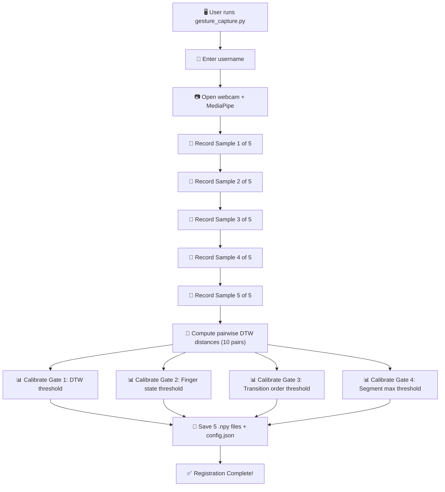

# 📹 WaveLock Gesture Capture Deep Dive

> **The Complete Registration Sequence — From Username to Saved Template**

This document walks you through **exactly** what happens when a user runs `python gesture_capture.py` and registers their gesture. Every stage is explained in detail with real examples using actual data from the system.

---

## Table of Contents

1. [Overview: What Registration Does](#1-overview)
2. [Step 0: Program Startup & Username Input](#2-step-0)
3. [Step 1: MediaPipe & Camera Initialization](#3-step-1)
4. [Step 2: The Recording Loop — Capturing 5 Samples](#4-step-2)
5. [Step 3: Recording a Single Sample (3 Seconds)](#5-step-3)
6. [Step 4: Spatial Normalization — Per Frame](#6-step-4)
7. [Step 5: Temporal Normalization — Across Frames](#7-step-5)
8. [Step 6: Threshold Calibration — The Brain of the System](#8-step-6)
9. [Step 7: Saving to Disk](#9-step-7)
10. [Step 8: What the Final Output Looks Like](#10-step-8)
11. [Complete Walkthrough: Registering "saimani" with Gesture "1-2-4-3"](#11-walkthrough)
12. [Quick Reference](#12-reference)

---

## 1. Overview: What Registration Does {#1-overview}

Registration is where the system **learns** your gesture. It creates a mathematical model of how *you* perform your gesture — capturing not just what the gesture looks like in a single perfect performance, but also the natural variation between multiple performances. This variation is used to calculate personalized security thresholds.



> [!IMPORTANT]
> Registration is not just "save a gesture." It's a statistical calibration process. The system records you performing the gesture 5 times specifically so it can measure **how much your own performances naturally vary**. This variation defines how strict or lenient the security thresholds will be for your account.

---

## 2. Step 0: Program Startup & Username Input {#2-step-0}

### What the code does

When you run `python gesture_capture.py`, the `main()` function in [gesture_capture.py](file:///c:/Users/asus/Desktop/final%20year%20-%20Copy/gesture_auth_project/gesture_capture.py) executes.

### 2a. Banner Display

```
==========================================================
   GESTURE REGISTRATION — Biometric Auth System
==========================================================
```

### 2b. List Existing Users

The function `list_registered_users()` from [gesture_compare.py](file:///c:/Users/asus/Desktop/final%20year%20-%20Copy/gesture_auth_project/gesture_compare.py) scans the `templates/` directory:

```python
# It looks for folders containing gesture_1.npy or gesture.npy
for entry in sorted(os.listdir(templates_dir)):
    user_dir = os.path.join(templates_dir, entry)
    has_new = os.path.exists(os.path.join(user_dir, "gesture_1.npy"))
    has_old = os.path.exists(os.path.join(user_dir, "gesture.npy"))
    if has_new or has_old:
        users.append(entry)
```

Output:
```
  Existing users: saimani, testing
```

### 2c. Username Input & Validation

```python
username = input("  Enter a username to register: ").strip()
username = username.lower().replace(" ", "_")   # Normalize: "Sai Mani" → "sai_mani"
```

If the username already exists, you're prompted to confirm re-registration:
```
  User 'saimani' already exists. Re-register? (y/n): y
```

### 2d. Setup Message

```
  Registering: saimani
  You will record your gesture 5 times.
  Perform the SAME gesture each time for best accuracy.
```

The `NUM_REGISTRATION_SAMPLES = 5` constant (defined in [gesture_compare.py](file:///c:/Users/asus/Desktop/final%20year%20-%20Copy/gesture_auth_project/gesture_compare.py#L39)) determines how many times you perform the gesture. Five samples gives 10 pairwise comparisons (C(5,2) = 10), which makes threshold calibration statistically robust.

---

## 3. Step 1: MediaPipe & Camera Initialization {#3-step-1}

### MediaPipe Hands Setup

`setup_mediapipe()` creates a neural-network-based hand detector:

```python
hands = mp_hands.Hands(
    static_image_mode=False,        # Video mode: uses temporal tracking
    max_num_hands=1,                # Only detect ONE hand
    min_detection_confidence=0.7,   # 70% confidence to initially detect
    min_tracking_confidence=0.5,    # 50% confidence to keep tracking
)
```

**Why these values?**
- `static_image_mode=False` enables MediaPipe's temporal tracking. After detecting a hand once, subsequent frames use cheaper tracking instead of full detection — this is much faster (~30 FPS).
- `max_num_hands=1` because the gesture password uses one hand only.
- `detection_confidence=0.7` is high enough to avoid false detections but low enough to work in imperfect lighting.
- `tracking_confidence=0.5` is lower because once a hand is found, we trust the tracker even when it's partially occluded.

### Camera Setup

`setup_camera()` opens the default webcam:

```python
cap = cv2.VideoCapture(CAMERA_INDEX)         # Open camera 0
cap.set(cv2.CAP_PROP_FRAME_WIDTH, 640)       # Request 640px wide
cap.set(cv2.CAP_PROP_FRAME_HEIGHT, 480)      # Request 480px tall

# Verify it works
ret, test_frame = cap.read()                  # Read a test frame
```

Output:
```
  Opening webcam (index 0)...
  Webcam ready — resolution: 640x480
```

---

## 4. Step 2: The Recording Loop — Capturing 5 Samples {#4-step-2}

The system records your gesture **5 separate times**. Each recording is handled by the function `record_one_sample()`.

```python
samples = []

for sample_num in range(1, NUM_REGISTRATION_SAMPLES + 1):
    print(f"  --- Sample {sample_num}/5 --- Press [R] when ready ---")
    
    sample = record_one_sample(
        cap, hands, mp_hands, mp_drawing, mp_drawing_styles,
        sample_num, NUM_REGISTRATION_SAMPLES, username
    )
    
    if sample is None:
        print("  Registration cancelled.")
        return
    
    samples.append(sample)   # Each sample is shape (60, 21, 3)
```

After the loop completes, `samples` is a **list of 5 NumPy arrays**, each with shape `(60, 21, 3)` — that's 60 frames × 21 landmarks × 3 coordinates.

> [!NOTE]
> **Why 5 samples instead of just 1?** You never perform a gesture exactly the same way twice. Sometimes you're a little faster, sometimes your fingers curl slightly differently, sometimes your hand is at a slightly different angle. 5 samples captures this natural human variation. The system uses these differences to learn what "acceptable variation" looks like for *your* specific gesture.

---

## 5. Step 3: Recording a Single Sample (3 Seconds) {#5-step-3}

Each sample goes through this lifecycle inside `record_one_sample()`:

### 5a. Idle State — Waiting for [R]

The webcam shows your hand with MediaPipe's skeleton overlay. The status bar says:

```
Sample 1/5 — Press [R] to record
```

If no hand is visible, the status changes to:
```
Show your hand to the camera...
```

**You cannot start recording without a visible hand.** If you press [R] without a hand:
```
  [!] Cannot record — no hand detected.
```

### 5b. Recording State — 3-Second Capture

When you press [R] with a hand visible:

```python
is_recording = True
recording_start_time = time.time()
recorded_frames = []
print("  [REC] Sample 1: recording for 3 seconds...")
```

For each frame during the 3-second window:

```python
if hand_visible:
    landmarks = extract_landmarks(results.multi_hand_landmarks[0])
    recorded_frames.append(landmarks)     # Append shape (21, 3) array
```

**What appears on screen during recording:**
- Status bar turns RED: `"RECORDING sample 1/5 — Perform your gesture!"`
- A progress bar fills up at the bottom
- A blinking red dot appears in the top-right corner (like a camera recording indicator)
- A frame counter shows: `"Frames captured: 74"`

**What if your hand disappears during recording?**
- That frame is simply skipped (not added to `recorded_frames`)
- A warning appears: `"! Hand lost — keep your hand visible !"`
- The recording timer keeps ticking — you don't get extra time

### 5c. Recording Complete — Validation

After 3 seconds (`RECORDING_DURATION_SEC = 3`):

```python
if len(recorded_frames) < 10:
    print(f"  [FAIL] Sample 1: too few frames (7). Retrying...")
    recorded_frames = []
    # Loop continues — you're asked to try again
else:
    raw = np.array(recorded_frames)              # Shape: (N, 21, 3), e.g., (74, 21, 3)
    normalized = normalize_gesture(raw, 60)       # Shape: (60, 21, 3)
    print(f"  [OK] Sample 1/5: captured 74 frames")
    return normalized
```

> [!WARNING]
> **The 10-frame minimum is critical.** If you keep your hand out of frame for most of the 3 seconds, you might only capture 5-6 frames. That's not enough data to represent a gesture — the temporal interpolation would produce garbage. So the system rejects it and asks you to try again.

### 5d. What Does a Raw Frame Look Like?

When MediaPipe processes a frame, it gives us 21 3D landmarks. `extract_landmarks()` in [landmarks.py](file:///c:/Users/asus/Desktop/final%20year%20-%20Copy/gesture_auth_project/utils/landmarks.py) converts these to a NumPy array:

```python
landmarks = np.array(
    [[lm.x, lm.y, lm.z] for lm in hand_landmarks.landmark],
    dtype=np.float64
)   # Shape: (21, 3)
```

A single raw frame for user "saimani" might look like:

```
Landmark  0 (WRIST):       [0.452, 0.823, 0.000]
Landmark  1 (THUMB_CMC):   [0.441, 0.763, -0.024]
Landmark  2 (THUMB_MCP):   [0.418, 0.705, -0.033]
Landmark  3 (THUMB_IP):    [0.390, 0.668, -0.041]
Landmark  4 (THUMB_TIP):   [0.362, 0.641, -0.048]
Landmark  5 (INDEX_MCP):   [0.421, 0.681, -0.012]
Landmark  6 (INDEX_PIP):   [0.410, 0.568, -0.031]
Landmark  7 (INDEX_DIP):   [0.404, 0.478, -0.058]
Landmark  8 (INDEX_TIP):   [0.401, 0.412, -0.089]
Landmark  9 (MIDDLE_MCP):  [0.445, 0.673, -0.008]
Landmark 10 (MIDDLE_PIP):  [0.442, 0.554, -0.029]
Landmark 11 (MIDDLE_DIP):  [0.441, 0.462, -0.061]
Landmark 12 (MIDDLE_TIP):  [0.440, 0.399, -0.081]
...
Landmark 20 (PINKY_TIP):   [0.513, 0.523, -0.061]
```

Over 3 seconds at ~25 FPS, you accumulate roughly **74 frames** of these arrays.

---

## 6. Step 4: Spatial Normalization — Per Frame {#6-step-4}

**Function:** `normalize_spatial()` in [normalize.py](file:///c:/Users/asus/Desktop/final%20year%20-%20Copy/gesture_auth_project/utils/normalize.py)

**Purpose:** Make the gesture look the same regardless of where the hand is positioned in the camera frame and how far it is from the camera.

### Step 4a: Translation — Center on Wrist

Every landmark's coordinates are shifted so the wrist becomes `[0, 0, 0]`:

```python
wrist = normalized[0].copy()    # e.g., [0.452, 0.823, 0.000]
normalized -= wrist             # Subtract from ALL 21 landmarks
```

**Concrete worked example:**

| Landmark | Raw Value | After Translation |
|----------|-----------|-------------------|
| 0 WRIST | [0.452, 0.823, 0.000] | **[0.000, 0.000, 0.000]** |
| 4 THUMB_TIP | [0.362, 0.641, -0.048] | [-0.090, -0.182, -0.048] |
| 8 INDEX_TIP | [0.401, 0.412, -0.089] | [-0.051, -0.411, -0.089] |
| 12 MIDDLE_TIP | [0.440, 0.399, -0.081] | [-0.012, -0.424, -0.081] |
| 16 RING_TIP | [0.476, 0.457, -0.073] | [0.024, -0.366, -0.073] |
| 20 PINKY_TIP | [0.513, 0.523, -0.061] | [0.061, -0.300, -0.061] |

> [!NOTE]
> **Why do this?** Imagine you perform your gesture in the center of the frame — wrist at (0.5, 0.5). Then you perform the exact same gesture but shifted to the right — wrist at (0.8, 0.5). Without translation, the coordinate values would be completely different even though the gesture is identical. By centering on the wrist, the gesture becomes **position-invariant**.

### Step 4b: Scaling — Normalize to Unit Sphere

Divide ALL coordinates by the maximum distance from the wrist:

```python
distances_from_wrist = np.linalg.norm(normalized, axis=1)
max_distance = np.max(distances_from_wrist)    # e.g., 0.424
if max_distance > 1e-6:
    normalized /= max_distance
```

**Continuing the example (max distance = 0.424 from MIDDLE_TIP):**

| Landmark | After Translation | After Scaling (÷ 0.424) |
|----------|-------------------|--------------------------|
| 0 WRIST | [0.000, 0.000, 0.000] | [0.000, 0.000, 0.000] |
| 8 INDEX_TIP | [-0.051, -0.411, -0.089] | [-0.120, -0.969, -0.210] |
| 12 MIDDLE_TIP | [-0.012, -0.424, -0.081] | [-0.028, -1.000, -0.191] |
| 20 PINKY_TIP | [0.061, -0.300, -0.061] | [0.144, -0.708, -0.144] |

Now the furthest landmark (MIDDLE_TIP) is at distance exactly 1.0 from the wrist, and all other landmarks are proportionally placed within that unit sphere.

> [!NOTE]
> **Why do this?** If you sit 50cm from the camera, your hand fills more of the frame than at 80cm. MediaPipe returns larger x,y values for the closer hand. Without scaling, the same gesture at two distances looks different. By scaling to a unit sphere, the gesture becomes **size/distance-invariant**.

After spatial normalization, one frame goes from raw `(21, 3)` to normalized `(21, 3)` — same shape, different values.

---

## 7. Step 5: Temporal Normalization — Across Frames {#7-step-5}

**Function:** `normalize_temporal()` in [normalize.py](file:///c:/Users/asus/Desktop/final%20year%20-%20Copy/gesture_auth_project/utils/normalize.py)

**Purpose:** Make all gestures have exactly the same number of frames, regardless of how fast or slow you performed them.

### The Problem

- Recording 1: You perform the gesture quickly → 68 frames captured
- Recording 2: You perform it slowly → 82 frames captured
- Recording 3: Frame drops on your webcam → 55 frames captured

You can't compare frame 30 of a 68-frame gesture with frame 30 of an 82-frame gesture — they represent different points in the gesture timeline.

### The Solution: Resample to 60 Frames via Linear Interpolation

```python
# Flatten spatial: (N, 21, 3) → (N, 63)
flat_sequence = gesture_sequence.reshape(n_frames, 63)

# Create time indices
original_t = np.linspace(0.0, 1.0, n_frames)   # e.g., 74 points from 0.0 to 1.0
target_t   = np.linspace(0.0, 1.0, 60)          # 60 points from 0.0 to 1.0

# Interpolate each of the 63 features along time
interpolator = interp1d(original_t, flat_sequence, axis=0, kind='linear')
resampled = interpolator(target_t)   # Shape: (60, 63)

# Unflatten: (60, 63) → (60, 21, 3)
```

### Concrete Worked Example (Simplified to 4→3 frames)

Suppose we recorded 4 frames and need 3. For the INDEX_TIP x-coordinate:

```
Original (4 frames):
  Time indices:  0.000    0.333    0.667    1.000
  Values:        0.10     0.30     0.70     0.90

Resampled (3 frames):
  Time indices:  0.000    0.500    1.000
  Values:        0.10     0.50     0.90
```

For frame at time 0.500, linear interpolation between the surrounding original frames:
- Left neighbor: (0.333, 0.30)
- Right neighbor: (0.667, 0.70)
- Fraction: (0.500 - 0.333) / (0.667 - 0.333) = 0.500
- Interpolated: 0.30 + 0.500 × (0.70 - 0.30) = **0.50**

This happens for ALL 63 features (21 landmarks × 3 coordinates) independently.

### Realistic Example (74→60 frames)

```
Sample 1: Recorded 74 frames in 3 seconds
  Original time indices: [0.000, 0.014, 0.027, ..., 0.986, 1.000]  (74 points)
  Target time indices:   [0.000, 0.017, 0.034, ..., 0.983, 1.000]  (60 points)

For each target time, the system finds the two closest original frames
and linearly blends between them. The result:

  Input:  (74, 21, 3) — variable frame count
  Output: (60, 21, 3) — fixed frame count ← always this shape
```

> [!IMPORTANT]
> After normalization, **every** gesture in the system — whether recorded, saved as a template, or captured live for authentication — is exactly `(60, 21, 3)`. This is critical. DTW comparison requires the data to be in a consistent format.

---

## 8. Step 6: Threshold Calibration — The Brain of the System {#8-step-6}

This is the most important step. After recording 5 samples, the system computes **4 personalized security thresholds** by analyzing how similar your own performances are to each other.

### 8a. Pairwise DTW Distances

The function `compute_threshold_from_samples()` in [gesture_compare.py](file:///c:/Users/asus/Desktop/final%20year%20-%20Copy/gesture_auth_project/gesture_compare.py) computes the DTW distance between every pair of your 5 samples.

With 5 samples, there are $C(5,2) = 10$ pairs:

```
compute_pairwise_distances(samples):
    for i in range(5):
        for j in range(i+1, 5):
            distances.append( DTW(sample_i, sample_j) )
```

**Real data from user "saimani":**

| Pair | Samples | DTW Distance |
|------|---------|-------------|
| 1 | Sample 1 vs Sample 2 | 1.2451 |
| 2 | Sample 1 vs Sample 3 | 2.0049 |
| 3 | Sample 1 vs Sample 4 | 1.2393 |
| 4 | Sample 1 vs Sample 5 | 1.3030 |
| 5 | Sample 2 vs Sample 3 | 2.0380 |
| 6 | Sample 2 vs Sample 4 | 1.2710 |
| 7 | Sample 2 vs Sample 5 | 1.1028 |
| 8 | Sample 3 vs Sample 4 | 1.5378 |
| 9 | Sample 3 vs Sample 5 | 1.6516 |
| 10 | Sample 4 vs Sample 5 | 0.8738 |

These 10 numbers describe saimani's **natural variation**. Samples 4 and 5 are most similar (0.87), while samples 2 and 3 are most different (2.04).

### 8b. Gate 1 Threshold: DTW Distance (Statistical v2)

The threshold is computed using a statistical method in `compute_threshold_details()`:

```python
# Step 1: Compute statistics
mean = 1.4267         # Average distance across 10 pairs
std  = 0.3590         # Standard deviation
P90  = 2.0082         # 90th percentile distance
max  = 2.0380         # Maximum distance (worst pair)

# Step 2: Compute three candidates
statistical = mean + (2.0 × std) = 1.4267 + 0.7180 = 2.1448
percentile  = P90 × 1.15         = 2.0082 × 1.15   = 2.3094
max_margin  = max × 1.25         = 2.0380 × 1.25   = 2.5475

# Step 3: Select the threshold
candidate = min(
    max(statistical, percentile),    # max(2.1448, 2.3094) = 2.3094
    max_margin,                       # 2.5475
    legacy_cap                        # max × 1.5 = 3.0570
)
# candidate = min(2.3094, 2.5475, 3.0570) = 2.3094

# Step 4: Apply floor
threshold = max(2.0, 2.3094) = 2.3094
```

**Result: `threshold = 2.3094`**

> [!NOTE]
> **What does this number mean?** Any live gesture with a DTW distance ≤ 2.31 from at least one stored template will pass Gate 1. Since saimani's own samples vary up to 2.04, setting the threshold at 2.31 gives a comfortable margin (0.27) for natural variation while keeping out gestures that are genuinely different.

### 8c. Gate 2 Threshold: Finger State Average Mismatch

`compute_finger_state_threshold_details()` computes how often the same fingers are extended across all pairs:

```python
# Real data for saimani:
pairwise_mismatches = [0.0567, 0.07, 0.0333, 0.1367, 0.0467,
                       0.0367, 0.1067, 0.0767, 0.12, 0.1433]

max_mismatch = 0.1433    # Worst pair: 14.33% of frames differ

threshold = max(0.12, 0.1433 + 0.08) = max(0.12, 0.2233) = 0.2233
threshold = min(0.30, 0.2233) = 0.2233
```

**Result: `finger_state_threshold = 0.2233`**

### 8d. Gate 3 Threshold: Finger Transition Order

`compute_transition_threshold_details()` computes edit distances between transition sequences:

```python
# After comparing finger raise/drop sequences across all 10 pairs:
max_dissimilarity = (the worst pair's normalized edit distance)

threshold = max(0.10, max_dissimilarity + 0.08)
threshold = min(0.40, threshold)
```

### 8e. Gate 4 Threshold: Segment Max Mismatch

`compute_segment_threshold_details()` divides each gesture into 6 segments and computes the worst-segment mismatch:

```python
max_max_mismatch = (the worst segment mismatch across all 10 pairs)

threshold = max(0.12, max_max_mismatch + 0.10)
threshold = min(0.50, threshold)
```

### 8f. Consistency Score

The system also computes a **consistency score** (0–100) that measures how consistently you performed the gesture:

```python
consistency_score = 100 × (1 - std/mean)
                  = 100 × (1 - 0.359/1.427)
                  = 100 × 0.7483
                  = 74.83
```

**Interpretation:**
- **90–100**: Very consistent performer, tight thresholds, high security
- **70–89**: Good consistency (saimani is here at 74.83)
- **50–69**: Moderate variation, looser thresholds
- **Below 50**: Very inconsistent, thresholds become wide

### Terminal Output After Calibration

```
  Computing optimal threshold from your samples...

  Pairwise distances between your recordings:
    Sample 1 vs Sample 2: 1.2451
    Sample 1 vs Sample 3: 2.0049
    Sample 1 vs Sample 4: 1.2393
    Sample 1 vs Sample 5: 1.3030
    Sample 2 vs Sample 3: 2.0380
    Sample 2 vs Sample 4: 1.2710
    Sample 2 vs Sample 5: 1.1028
    Sample 3 vs Sample 4: 1.5378
    Sample 3 vs Sample 5: 1.6516
    Sample 4 vs Sample 5: 0.8738
  Max variation:     2.0380
  Consistency score: 74.8/100
  Threshold method:  statistical_v2
  Computed threshold:      2.3094
  Finger mismatch limit:   0.2233
  Transition order limit:  0.3657
  Segment mismatch limit:  0.3800
```

---

## 9. Step 7: Saving to Disk {#9-step-7}

`save_registration()` in [gesture_compare.py](file:///c:/Users/asus/Desktop/final%20year%20-%20Copy/gesture_auth_project/gesture_compare.py#L1066-L1194) creates everything:

### 9a. Create Directory

```python
user_dir = os.path.join(TEMPLATES_DIR, username)    # templates/saimani/
os.makedirs(user_dir, exist_ok=True)
```

### 9b. Clean Old Files (Re-registration)

If the user already exists, all old files are deleted first:
```python
for old_file in os.listdir(user_dir):
    os.remove(os.path.join(user_dir, old_file))
```

### 9c. Save Each Sample as .npy

```python
for i, sample in enumerate(samples, start=1):
    filepath = os.path.join(user_dir, f"gesture_{i}.npy")
    np.save(filepath, sample)   # Saves (60, 21, 3) array
```

This creates:
```
templates/saimani/gesture_1.npy   →  (60, 21, 3) float64
templates/saimani/gesture_2.npy   →  (60, 21, 3) float64
templates/saimani/gesture_3.npy   →  (60, 21, 3) float64
templates/saimani/gesture_4.npy   →  (60, 21, 3) float64
templates/saimani/gesture_5.npy   →  (60, 21, 3) float64
```

Each `.npy` file is approximately **28.9 KB** (60 × 21 × 3 × 8 bytes for float64).

### 9d. Save config.json

All 4 thresholds, plus calibration metadata for debugging and analysis:

```json
{
  "threshold": 2.3094,
  "num_samples": 5,
  "threshold_method": "statistical_v2",
  "finger_state_threshold": 0.2233,
  "finger_state_method": "finger_state_sequence_v1",
  "finger_state_pairwise_mismatches": [0.0567, 0.07, ...],
  "pairwise_distances": [1.2451, 2.0049, ...],
  "mean_pairwise_distance": 1.4267,
  "std_pairwise_distance": 0.359,
  "consistency_score": 74.83,
  "transition_threshold": 0.3657,
  "transition_method": "transition_edit_distance_v1",
  "segment_threshold": 0.38,
  "segment_method": "segment_max_mismatch_v1",
  "segment_count": 6,
  ...
}
```

### 9e. Final Output

```
  ==================================================
  REGISTRATION COMPLETE for 'saimani'!
  ==================================================
  Samples saved:  5
  Threshold:      2.3094
  Location:       .../templates/saimani

  You can now authenticate with:
    python gesture_auth.py
```

---

## 10. Step 8: What the Final Output Looks Like {#10-step-8}

After registration, the `templates/saimani/` folder contains:

```
templates/saimani/
├── config.json       (2.1 KB)  ← All 4 thresholds + metadata
├── gesture_1.npy     (28.9 KB) ← Normalized sample 1: (60, 21, 3)
├── gesture_2.npy     (28.9 KB) ← Normalized sample 2: (60, 21, 3)
├── gesture_3.npy     (28.9 KB) ← Normalized sample 3: (60, 21, 3)
├── gesture_4.npy     (28.9 KB) ← Normalized sample 4: (60, 21, 3)
└── gesture_5.npy     (28.9 KB) ← Normalized sample 5: (60, 21, 3)
```

**Total storage per user: ~147 KB**

---

## 11. Complete Walkthrough: Registering "saimani" with Gesture "1-2-4-3" {#11-walkthrough}

Here's the complete end-to-end story:

### 11a. User runs the program
```bash
python gesture_capture.py
```

### 11b. Terminal interaction
```
==========================================================
   GESTURE REGISTRATION — Biometric Auth System
==========================================================

  Existing users: testing

  Enter a username to register: saimani

  Registering: saimani
  You will record your gesture 5 times.
  Perform the SAME gesture each time for best accuracy.

  Opening webcam (index 0)...
  Webcam ready — resolution: 640x480
```

### 11c. Recording 5 samples

For each sample, saimani performs the gesture "1-2-4-3" (raise index → middle → ring → pinky in that order):

```
  --- Sample 1/5 --- Press [R] when ready ---
  [REC] Sample 1: recording for 3 seconds...
  [OK] Sample 1/5: captured 74 frames
        Ready for sample 2/5.

  --- Sample 2/5 --- Press [R] when ready ---
  [REC] Sample 2: recording for 3 seconds...
  [OK] Sample 2/5: captured 78 frames
        Ready for sample 3/5.

  --- Sample 3/5 --- Press [R] when ready ---
  [REC] Sample 3: recording for 3 seconds...
  [OK] Sample 3/5: captured 71 frames
        Ready for sample 4/5.

  --- Sample 4/5 --- Press [R] when ready ---
  [REC] Sample 4: recording for 3 seconds...
  [OK] Sample 4/5: captured 76 frames
        Ready for sample 5/5.

  --- Sample 5/5 --- Press [R] when ready ---
  [REC] Sample 5: recording for 3 seconds...
  [OK] Sample 5/5: captured 80 frames
```

Each raw recording (74, 78, 71, 76, 80 frames) is immediately normalized to (60, 21, 3).

### 11d. Threshold calibration

```
  Computing optimal threshold from your samples...

  Pairwise distances between your recordings:
    Sample 1 vs Sample 2: 1.2451
    Sample 1 vs Sample 3: 2.0049
    Sample 1 vs Sample 4: 1.2393
    Sample 1 vs Sample 5: 1.3030
    Sample 2 vs Sample 3: 2.0380
    Sample 2 vs Sample 4: 1.2710
    Sample 2 vs Sample 5: 1.1028
    Sample 3 vs Sample 4: 1.5378
    Sample 3 vs Sample 5: 1.6516
    Sample 4 vs Sample 5: 0.8738
  Max variation:     2.0380
  Consistency score: 74.8/100
  Threshold method:  statistical_v2
  Computed threshold:      2.3094
  Finger mismatch limit:   0.2233
  Transition order limit:  0.3657
  Segment mismatch limit:  0.3800
```

### 11e. Completion

```
  ==================================================
  REGISTRATION COMPLETE for 'saimani'!
  ==================================================
  Samples saved:  5
  Threshold:      2.3094
  Location:       .../templates/saimani

  You can now authenticate with:
    python gesture_auth.py
```

---

## 12. Quick Reference {#12-reference}

### Key Constants

| Constant | Value | Purpose |
|----------|-------|---------|
| `RECORDING_DURATION_SEC` | 3 seconds | Each recording window |
| `TARGET_FRAMES` | 60 | Fixed frame count after normalization |
| `NUM_REGISTRATION_SAMPLES` | 5 | Times to perform the gesture |
| `MIN_THRESHOLD` | 2.0 | Floor for DTW threshold |
| `THRESHOLD_STD_FACTOR` | 2.0 | Standard deviation multiplier |
| `THRESHOLD_PERCENTILE` | 90 | Percentile used for calibration |
| `FINGER_STATE_MARGIN` | 0.08 | Margin added to finger mismatch |
| `TRANSITION_MARGIN` | 0.08 | Margin for transition order |
| `SEGMENT_MARGIN` | 0.10 | Margin for segment max mismatch |
| `SEGMENT_COUNT` | 6 | Segments per gesture |

### Files Created Per User

| File | Shape/Size | Contents |
|------|-----------|----------|
| `gesture_1.npy` through `gesture_5.npy` | (60, 21, 3) float64, ~29 KB each | Normalized gesture templates |
| `config.json` | ~2 KB | 4 thresholds + calibration metadata |

### The Complete Data Transformation Pipeline

```
Raw MediaPipe output per frame:    (21, 3)    ← x,y in [0,1], z relative
  ↓ Accumulate over 3 seconds
Raw recording:                     (N, 21, 3)  ← N ≈ 70-80 frames
  ↓ normalize_spatial() per frame
Spatially normalized:              (N, 21, 3)  ← wrist at origin, unit sphere
  ↓ normalize_temporal()
Fully normalized:                  (60, 21, 3) ← fixed 60 frames
  ↓ np.save()
Saved template:                    gesture_K.npy
```
