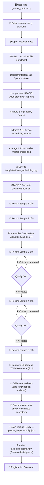

# 📹 WaveLock Gesture & Biometric Capture Deep Dive

> **The Complete Registration Sequence — From Facial Identity to Calibrated Gesture Templates**

This document walks you through **exactly** what happens when a user runs `python gesture_capture.py` to register an identity. Every stage is explained in complete mathematical and algorithmic detail with real code examples and terminal traces.

---

## Table of Contents

1. [Overview: The 2-Stage Enrollment Pipeline](#1-overview)
2. [Step 0: Program Startup & Username Validation](#2-step-0)
3. [Step 1: Stage 1 — Facial Profile Enrollment (`capture_face_enrollment_phase`)](#3-step-1)
4. [Step 1B: Standalone Face Enrollment Tool (`enroll_face.py`)](#4-step-1b)
5. [Step 2: Stage 2 — MediaPipe & Camera Initialization](#5-step-2)
6. [Step 3: The Multi-Sample Recording Loop (5 Samples with Quality Gate)](#6-step-3)
7. [Step 4: Recording a Single Sample (2–3 Seconds)](#7-step-4)
8. [Step 5: Spatial Normalization (Wrist-Origin, Unit-Sphere)](#8-step-5)
9. [Step 6: Temporal Normalization (60 Frames via SciPy)](#9-step-6)
10. [Step 7: The Quality Gate (Outlier Detection)](#10-step-7)
11. [Step 8: MAD-Based Robust Threshold Calibration](#11-step-8)
12. [Step 9: Cohort-Based Negative Sampling (6 Synthetic Impostors)](#12-step-9)
13. [Step 10: Saving to Disk & Template Preservation](#13-step-10)
14. [Step 11: Complete End-to-End Walkthrough Trace](#14-step-11)
15. [Quick Reference & Disk Artifacts](#15-reference)

---

## 1. Overview: The 2-Stage Enrollment Pipeline {#1-overview}

Registration is where WaveLock builds a personalized mathematical model of **who you are** and **what you know**.

Traditional gesture systems only record hand movement, leaving them completely vulnerable if an observer watches the gesture. Conversely, traditional face systems only capture a static picture, making them vulnerable to 2D photo spoofs. WaveLock binds both modalities during a seamless 2-stage enrollment:


```mermaid
graph TD
    A["🖥️ User runs gesture_capture.py"] --> B["👤 Enter username (e.g. saimani)"]
    B --> C["📷 Open Webcam Feed"]
    
    %% Stage 1
    C --> D["STAGE 1: Facial Profile Enrollment"]
    D --> D1["Detect frontal face via OpenCV YuNet"]
    D1 --> D2["User presses [SPACE] when green box appears"]
    D2 --> D3["Capture 5 high-fidelity frames"]
    D3 --> D4["Extract 128-D SFace embedding vectors"]
    D4 --> D5["Average & L2-normalize master embedding"]
    D5 --> D6["💾 Save to templates/<user>/face_embedding.npy"]
    
    %% Stage 2
    D6 --> E["STAGE 2: Dynamic Gesture Enrollment"]
    E --> F["🔴 Record Sample 1 of 5"]
    F --> G["🔴 Record Sample 2 of 5"]
    G --> H["🔍 Interactive Quality Gate Activates (Sample 3+)"]
    H --> I["🔴 Record Sample 3 of 5"]
    I --> I2{"Quality OK?"}
    I2 -->|"✓ Accepted"| J["🔴 Record Sample 4 of 5"]
    I2 -->|"✗ Outlier → re-record"| I
    J --> J2{"Quality OK?"}
    J2 -->|"✓ Accepted"| K["🔴 Record Sample 5 of 5"]
    J2 -->|"✗ Outlier → re-record"| J
    
    %% Calibration & Save
    K --> L["🧮 Compute 10 pairwise DTW distances (C(5,2))"]
    L --> M["📊 Calibrate thresholds using MAD (robust statistics)"]
    M --> N["🧪 Cohort uniqueness check (6 synthetic impostors)"]
    N --> O["💾 Save gesture_1.npy ... gesture_5.npy + config.json"]
    O --> P["🔒 Anchor face_embedding.npy (Preserve facial profile)"]
    P --> Q["🎉 Registration Complete!"]
```

> [!IMPORTANT]
> Registration creates a complete multimodal profile:
> 1. **High-Entropy Facial Vector**: 128 floating-point numbers on the unit hypersphere.
> 2. **5 Normalized Gesture Samples**: Each of shape `(60, 21, 3)`.
> 3. **4 Personalized Security Thresholds**: Auto-tuned using outlier-resistant Median Absolute Deviation (MAD).
> 4. **Anthropometric Hand Geometry Profile**: 5 posture-invariant bone ratios calibrated from the metacarpal palm plate (`metacarpal_invariant_v2`).
> 5. **Kinematic Rhythm Profile**: 10-bin velocity histogram, jerk baseline, peak velocity phase, and dwell limits.

---

## 2. Step 0: Program Startup & Username Validation {#2-step-0}

When you run `python gesture_capture.py`, `main()` initializes the registration session:

```python
username = input("  Enter a username to register: ").strip()
username = username.lower().replace(" ", "_")   # Normalize: "Sai Mani" → "sai_mani"
```

If the username already exists:
```
  User 'saimani' already exists. Re-register? (y/n): y
```

Output:
```
  Registering: saimani
  Stage 1: Face Enrollment -> Stage 2: 5 Gesture Samples
```

---

## 3. Step 1: Stage 1 — Facial Profile Enrollment (`capture_face_enrollment_phase`) {#3-step-1}

Stage 1 binds the physical face of the person to the account before any gestures are recorded.

### What happens in the code

```python
face_emb_result = capture_face_enrollment_phase(cap, username)
```

1. **OpenCV YuNet Detection**:
   The frame is passed to `detect_primary_face(frame)` using `cv2.FaceDetectorYN`:
   ```python
   detector = get_face_detector(input_size=(w, h))
   _, faces = detector.detect(frame)
   ```
   YuNet detects facial bounding boxes and 5 key facial landmarks (right eye, left eye, nose tip, right mouth corner, left mouth corner) at ~5 ms per frame.
   
2. **On-Screen Visual Guide**:
   - When a face is detected with confidence $\ge 70\%$, a **green bounding box** frames the user's face with the score.
   - Guide prompt: `"Press [SPACE] to capture (Anti-Sibling Security) | [S] Skip"`.

3. **5-Frame High-Fidelity Burst Capture**:
   When the user presses `[SPACE]`, the system captures **5 consecutive frames** of the face:
   ```python
   emb = extract_face_embedding(frame, face_row)
   captured_embs.append(emb)
   ```
   For each frame:
   - `recognizer.alignCrop(frame, face_row)`: Uses the 5 landmarks to rotate, align, and crop a standardized **112×112 pixel face chip**.
   - `recognizer.feature(aligned_face)`: Feeds the 112×112 chip into the pre-trained SFace deep neural network to produce a **128-dimensional feature embedding vector**.

4. **Master Embedding Averaging & L2-Normalization**:
   To eliminate high-frequency camera noise and subtle micro-motions, the 5 embeddings are averaged and projected onto the unit hypersphere:
   ```python
   master = np.mean(captured_embs, axis=0)
   master /= np.linalg.norm(master)  # Unit length: ||master|| = 1.0
   ```

5. **Saving to Disk**:
   ```python
   save_path = save_face_embedding(username, master, TEMPLATES_DIR)
   ```
   Saves to `templates/<username>/face_embedding.npy`.

6. **Safe Bypass (Legacy Mode)**:
   If the user presses `[S]`, `capture_face_enrollment_phase` returns `None`. The system proceeds to gesture enrollment without a face, allowing backward compatibility.

---

## 4. Step 1B: Standalone Face Enrollment Tool (`enroll_face.py`) {#4-step-1b}

If an account was already registered without a face, or if the user wants to update their face embedding (e.g. new spectacles, seasonal change), they do **not** need to re-record their 5 gesture samples.

They simply run:
```bash
python enroll_face.py --user saimani
```

### What `enroll_face.py` does:
- Opens the camera and tracks the face.
- Prompts the user to look straight into the camera.
- On `[SPACE]`, captures the 5-frame burst.
- Computes the 128-D master vector.
- Overwrites only `templates/<username>/face_embedding.npy` while leaving all gesture templates and `config.json` completely untouched.

---

## 5. Step 2: Stage 2 — MediaPipe & Camera Initialization {#5-step-2}

Once the face is anchored, the system transitions to gesture enrollment:

```
  ============================================================
    STEP 2 OF 2: Gesture Trajectory & Kinematic Enrollment
    You will record your gesture 5 times.
  ============================================================
```

### Camera Auto-Detection

The current codebase uses `utils/camera_utils.py` which:
- Auto-detects connected cameras via DirectShow (Windows) probing
- Prioritizes external USB webcams (index > 0) over internal laptop cameras
- Performs sensor warmup by flushing up to 18 initial black frames until mean brightness exceeds 8.0 (handles USB sensor auto-exposure ramp-up, typically ~12 frames / 0.8s for Logitech C270)
- Supports CLI override with `--camera N` flag
- Uses `open_camera()` function which handles backend selection (DirectShow on Windows, fallback to default)

The camera init in `gesture_capture.py` calls:
```python
cap = setup_camera(camera_index=args.camera)
```
which delegates to `open_camera()` from `utils/camera_utils.py`.

### MediaPipe Hands Setup
```python
hands = mp_hands.Hands(
    static_image_mode=False,        # Temporal tracking mode (~30 FPS)
    max_num_hands=1,                # Monitored hand
    min_detection_confidence=0.7,   # 70% confidence to detect
    min_tracking_confidence=0.5,    # 50% confidence to maintain track
)
```

---

## 6. Step 3: The Multi-Sample Recording Loop (5 Samples with Quality Gate) {#6-step-3}

The system prompts the user to perform the gesture **5 separate times**.

```python
samples = []
max_retries_per_sample = 3

sample_num = 1
while sample_num <= NUM_REGISTRATION_SAMPLES:
    retries = 0
    accepted = False
    while not accepted:
        sample = record_one_sample(...)
        is_ok, quality_msg = validate_sample_quality(sample, samples)
        if is_ok:
            samples.append(sample)
            accepted = True
        else:
            retries += 1
            # Re-record prompt
```

### Why 5 Samples?
Human motor execution has natural variance. Five samples produce:
$$inom{5}{2} = rac{5 	imes 4}{2} = 10 	ext{ pairwise comparisons}$$
These 10 pairwise comparisons provide the empirical variance needed to calibrate tight, personalized security thresholds.

---

## 7. Step 4: Recording a Single Sample (2–3 Seconds) {#7-step-4}

1. User presses `[R]` when ready.
2. An on-screen progress bar fills over 2–3 seconds.
3. For each frame where a hand is detected:
   - MediaPipe extracts 21 3D landmarks: $(x, y, z)$ where $x, y \in [0, 1]$ are screen-normalized and $z$ represents relative depth.
   - Stored as a NumPy array of shape `(N, 21, 3)`, where $N$ is the number of captured frames (typically 65–90 frames).

---

## 8. Step 5: Spatial Normalization (Wrist-Origin, Unit-Sphere) {#8-step-5}

Raw coordinates depend on where the hand is on the screen and how close it is to the camera.

Spatial normalization transforms the hand into a scale- and position-invariant coordinate space:

```python
def normalize_spatial(landmarks_array):
    # 1. Translate wrist (landmark 0) to origin (0, 0, 0)
    wrist = landmarks_array[:, 0:1, :]
    centered = landmarks_array - wrist
    
    # 2. Compute maximum distance from wrist to any landmark
    distances = np.linalg.norm(centered, axis=2)
    max_dist = np.max(distances)
    
    # 3. Scale to unit sphere
    scale = max_dist if max_dist > 1e-6 else 1.0
    return centered / scale
```

Now the hand is centered at the wrist, and all landmarks fit within a sphere of radius $1.0$.

---

## 9. Step 6: Temporal Normalization (60 Frames via SciPy) {#9-step-6}

Gestures vary in speed. A 2.5-second gesture might capture 75 frames; a 2.8-second gesture might capture 84 frames.

Using `scipy.interpolate.interp1d`:
```python
def normalize_temporal(landmarks_array, target_frames=60):
    n_frames = landmarks_array.shape[0]
    time_original = np.linspace(0, 1, n_frames)
    time_target = np.linspace(0, 1, target_frames)
    
    # Interpolate each of the 21 x 3 = 63 coordinates independently
    interpolator = interp1d(time_original, landmarks_array, axis=0, kind='linear')
    return interpolator(time_target)
```

Output: Every gesture sample is resampled to exactly **(60, 21, 3)**.

---

## 10. Step 7: The Quality Gate (Outlier Detection) {#10-step-7}

Starting at **Sample 3**, the system validates whether the new recording is consistent with previously accepted samples before admitting it to the template set:

```python
def validate_sample_quality(candidate, existing_samples, factor=1.4):
    if len(existing_samples) < 2:
        return True, "Initial baseline"
    
    # Compute DTW distance from candidate to each existing sample
    distances_to_existing = [compute_dtw_distance(candidate, s) for s in existing_samples]
    candidate_avg = np.mean(distances_to_existing)
    
    # Compute inter-sample distances among accepted samples
    intra_distances = [...]
    median_intra = np.median(intra_distances)
    
    limit = median_intra * factor
    if candidate_avg <= limit:
        return True, "Consistent with baseline"
    else:
        return False, f"Irregular motion (distance {candidate_avg:.2f} > limit {limit:.2f})"
```

If an arm jerk or hesitation occurred during Sample 4, the Quality Gate intercepts it, prints an on-screen warning, and asks for a re-recording. This prevents corrupted data from inflating the security thresholds.

---

## 11. Step 8: MAD-Based Robust Threshold Calibration {#11-step-8}

Standard deviation is vulnerable on small sample sizes (10 pairwise distances). A single slightly loose sample skews $\sigma$.

WaveLock uses **Median Absolute Deviation (MAD)**:

```python
distances = [d(s1,s2), d(s1,s3), ..., d(s4,s5)]  # 10 values

# Compute robust statistics
median_dist = np.median(distances)
mad = np.median(np.abs(distances - median_dist))
robust_std = 1.4826 * mad  # Asymptotically normal standard deviation estimate

# Threshold candidate
robust_candidate = median_dist + (2.5 * robust_std)
percentile_candidate = np.percentile(distances, 90) * 1.15
max_margin = np.max(distances) * 1.25

# Select optimal threshold with security floor
threshold = min(max(robust_candidate, percentile_candidate), max_margin)
threshold = max(2.0, threshold)  # MIN_THRESHOLD floor = 2.0
```

### Calibrating the Remaining Gates:
- **Finger State Threshold**: $	ext{clamp}(	ext{max\_mismatch} + 0.08, 0.12, 0.30)$
- **Transition Order Threshold**: $	ext{clamp}(	ext{max\_dissim} + 0.08, 0.10, 0.40)$
- **Segment Max Threshold**: $	ext{clamp}(	ext{max\_seg\_mismatch} + 0.10, 0.12, 0.50)$

---

## 12. Step 9: Cohort-Based Negative Sampling (6 Synthetic Impostors) {#12-step-9}

Before saving, WaveLock generates a cohort of 6 synthetic impostor gestures from `cohort_library.py`:
1. Static open hand
2. Static fist
3. All-fingers waving
4. Sequential forward wave
5. Sequential backward wave
6. Random finger flutter

It computes the **Impostor Separation Ratio**:
$$	ext{Ratio} = rac{\min(	ext{DTW}_{	ext{impostor}})}{\max(	ext{DTW}_{	ext{intra}})}$$

- **If Ratio $\ge 1.50	imes$**: `✓ Gesture is unique!`
- **If Ratio $< 1.50	imes$**: `⚠ WARNING: Gesture too simple or common. Consider a more dynamic gesture.`

---

## 13. Step 10: Saving to Disk & Template Preservation {#13-step-10}

`save_registration()` writes the finalized template files:

```python
user_dir = os.path.join(TEMPLATES_DIR, username)
os.makedirs(user_dir, exist_ok=True)

# 1. Clean old gesture files while STRICTLY PRESERVING face_embedding.npy
for old_file in os.listdir(user_dir):
    if old_file != "face_embedding.npy":
        os.remove(os.path.join(user_dir, old_file))

# 2. Save the 5 normalized gesture templates
for i, sample in enumerate(samples, start=1):
    np.save(os.path.join(user_dir, f"gesture_{i}.npy"), sample)

# 3. Save config.json
with open(os.path.join(user_dir, "config.json"), "w") as f:
    json.dump(config, f, indent=2)

# 4. Anchor face_embedding.npy
if face_emb_result is not None:
    save_face_embedding(username, face_emb_result, TEMPLATES_DIR)
```

### Biometric Profile Calibration

Between the quality gate and disk save, the system builds intrinsic physical signatures:

```python
# ── Biometric Identity Profile (Anti-Shoulder-Surfing) ──
anthro_profile = calibrate_anthropometric_profile(samples)
kinematic_profile = calibrate_kinematic_profile(samples)
```

- `calibrate_anthropometric_profile(samples)` computes the 5-feature metacarpal_invariant_v2 baseline from all 5 templates. It extracts per-frame bone ratios using rigid palm landmarks, takes the median across frames per template, then averages across templates to produce a baseline vector, standard deviation, and auto-calibrated tolerance (`max_dev * 1.6`, capped at `DEFAULT_ANTHRO_TOLERANCE = 0.15`, floored at `MIN_ANTHRO_TOLERANCE = 0.12`).
- `calibrate_kinematic_profile(samples)` extracts velocity profiles from fingertip landmarks (8, 12, 16, 20), bins them into 10 temporal phases normalized to sum to 1.0, computes mean jerk across templates, peak velocity phase, and max mid-gesture dwell. Tolerance is calibrated as `max(0.35, max_dev * 1.6)` capped at 0.55.
- Both profiles are stored in `config.json` alongside the gesture thresholds.

---

## 14. Complete End-to-End Walkthrough Trace {#14-step-11}

```text
==========================================================
   GESTURE REGISTRATION — Biometric Auth System
==========================================================
  Existing users: facetest, saimani

  Enter a username to register: saimani

  Registering: saimani
  Stage 1: Face Enrollment -> Stage 2: 5 Gesture Samples

  Opening webcam (index 0)...
  Webcam ready — resolution: 640x480

  [Stage 1: Looking into camera...]
  ✓ Face detected (98%)
  Capturing high-fidelity face burst (5 frames)...
  ✓ Face enrolled successfully! Saved to face_embedding.npy

  ============================================================
    STEP 2 OF 2: Gesture Trajectory & Kinematic Enrollment
    You will record your gesture 5 times.
  ============================================================

  --- Sample 1/5 --- Press [R] when ready ---
        ✓ Sample 1 (initial baseline)

  --- Sample 2/5 --- Press [R] when ready ---
        ✓ Sample 2 (initial baseline)

  --- Sample 3/5 --- Press [R] when ready ---
        ✓ Sample 3 Consistent with baseline

  --- Sample 4/5 --- Press [R] when ready ---
        ✗ Sample 4 had irregular motion. Let's re-record that one.
  --- Sample 4/5 (Retry 1) --- Press [R] when ready ---
        ✓ Sample 4 Consistent with baseline

  --- Sample 5/5 --- Press [R] when ready ---
        ✓ Sample 5 Consistent with baseline

  Computing optimal threshold from your samples...
  Checking gesture uniqueness against common patterns...
  ✓ Gesture is unique! (impostor ratio: 18.42x)

  Hand bone aspect ratio:  0.5523 (tolerance: ±15%)
  Kinematic jerk baseline: 0.00025
  Biometric identity baseline calibrated (Anti-Shoulder-Surfing enabled).

  ==================================================
  REGISTRATION COMPLETE for 'saimani'!
  ==================================================
  Samples saved:  5
  Threshold:      2.3094
  Face Profile:   ENROLLED (face_embedding.npy)
  Location:       C:\Users\...\templates\saimani
```

---

## 15. Quick Reference & Disk Artifacts {#15-reference}

| Disk Artifact | Shape / Size | Purpose |
| :--- | :--- | :--- |
| `face_embedding.npy` | `(128,)` float32 (~512 B) | Normalized master facial identity embedding vector on unit hypersphere. |
| `gesture_1.npy` ... `gesture_5.npy` | `(60, 21, 3)` float64 (~28.9 KB each) | 5 spatially- and temporally-normalized gesture trajectory templates. |
| `config.json` | JSON text (~2.6 KB) | MAD-calibrated thresholds, anthropometric hand geometry profile (`metacarpal_invariant_v2`), kinematic rhythm profile, inter-sample distances, and consistency scores. |

### Enrollment Commands
- **Full Registration (Face + Gesture)**:
  ```bash
  python gesture_capture.py
  ```
- **Face-Only Quick Enrollment / Update**:
  ```bash
  python enroll_face.py --user <username>
  ```
- **Camera Selection**:
  ```bash
  # With specific camera
  python gesture_capture.py --camera 1
  python enroll_face.py --user <username> --camera 1

  # List available cameras
  python gesture_capture.py --list-cams
  ```
